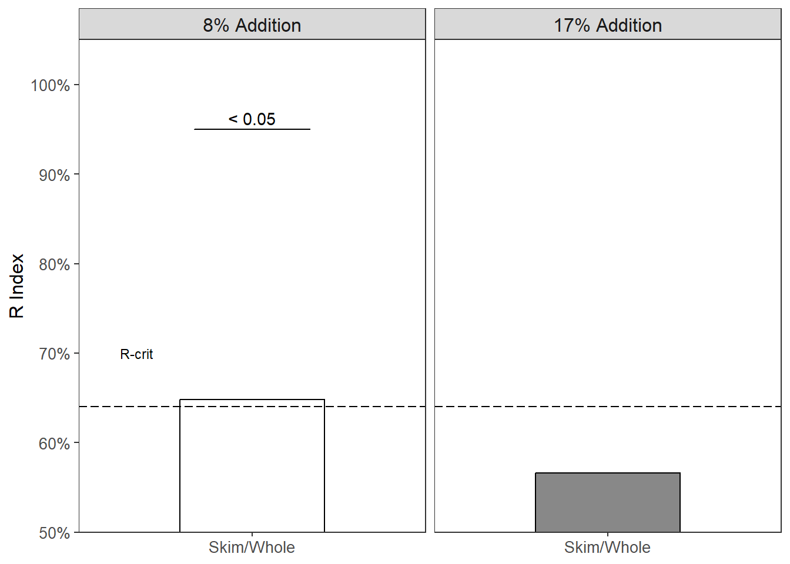
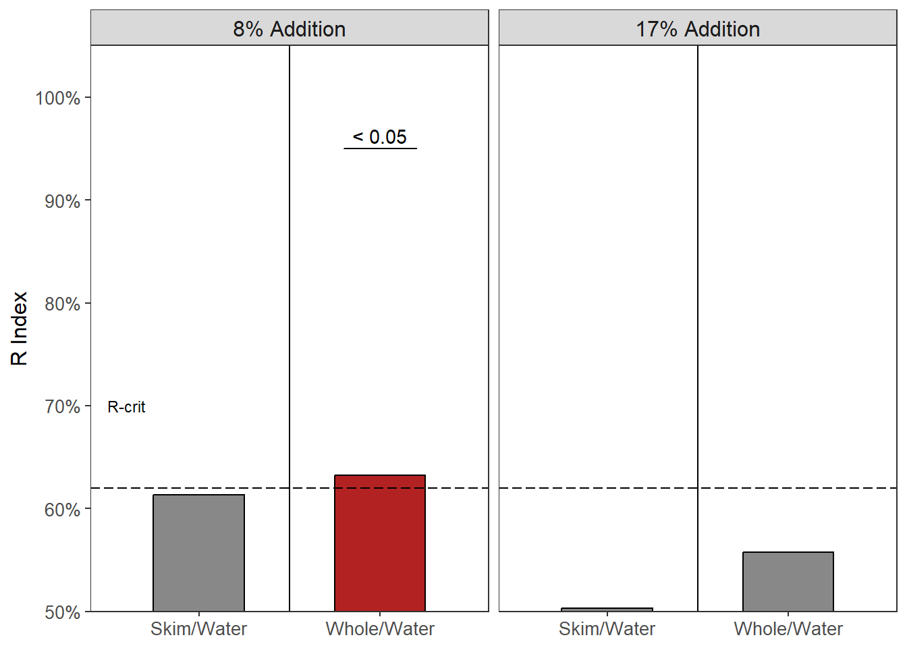
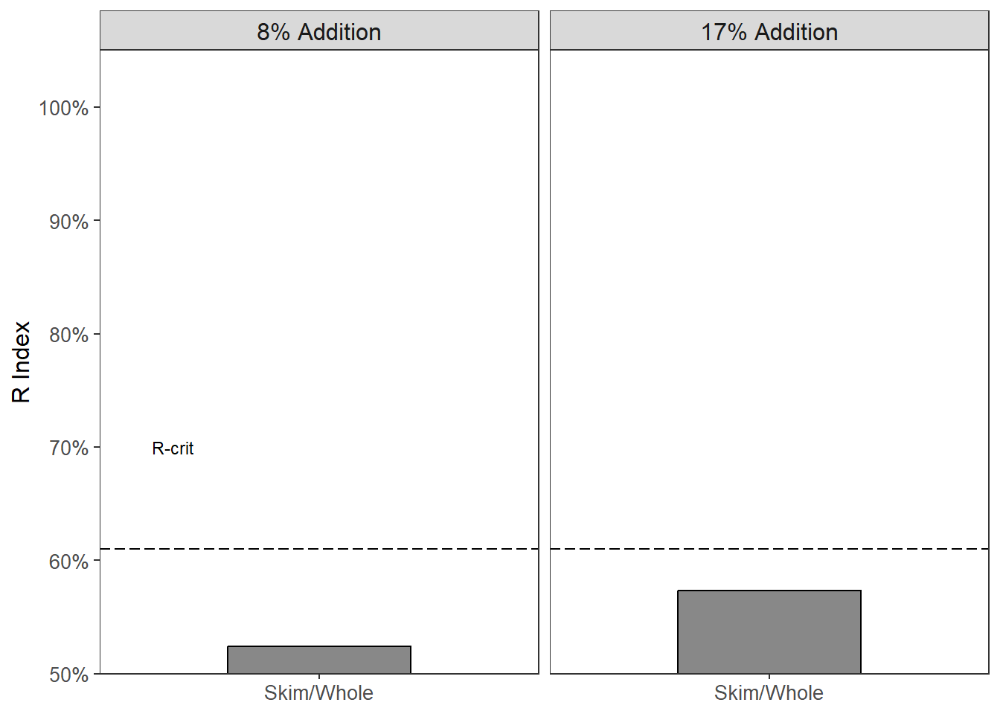
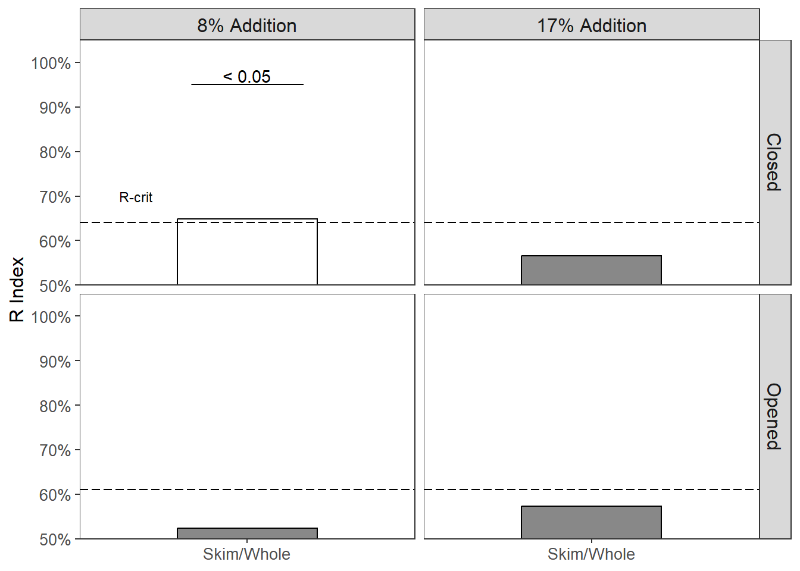
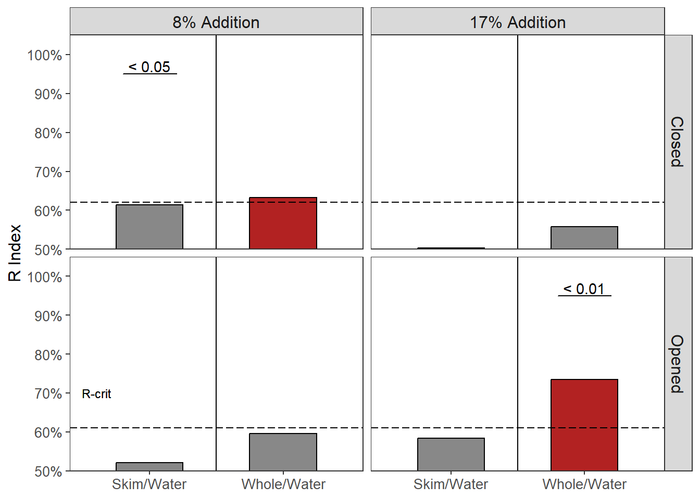

# 1:10 Bitterness {#Bitter10}

This will be the data analysis and results of the 1:10 nose closed study run in December 2024 and the 1:10 nose open study run in September 2023.  

A 1:10 brew strength (coffee:water, w/w) is representative of a strong ratio used by everyday consumers. Our hypotheses was:  

> Milk will reduce the bitterness of cold brew coffee more than water  

This hypothesis is thought to be seen regardless of condition (nose closed or nose open). 

Some interpretations of expected data would be:

- In the nose closed condition a reduction in bitterness from the milky coffee would suggest a physicochemical interaction between the milk and coffee  
- Milk, being 86% water [@walstraDairyTechnologyPrinciples1999] could have a similar effect as water would when added to coffee   
- In the nose opened condition, a reduction in bitterness from the milky coffee could suggest a cross-modal interaction (particularly if no effect is seen in the nose closed condition) 

> Inclusion criteria included drinking coffee at least once a month.


## Nose Closed Condition
### Participant Data

``` r
Study1Meta <- read_xlsx(path = "Objective1CompiledDataWithIndex.xlsx", sheet = 4) %>% clean_names()
colnames(Study1Meta)
```

```
##  [1] "panelist_code"         "age"                   "gender"               
##  [4] "indian_alaskan"        "asian_indian_islander" "black"                
##  [7] "white"                 "hispanic_latino"       "other"                
## [10] "consumption"           "sweetener"             "whitener"             
## [13] "how_white"
```

``` r
Study1Meta %>% filter(consumption == "6") #osu27
```

```
## # A tibble: 1 × 13
##   panelist_code   age gender indian_alaskan asian_indian_islander black white
##   <chr>         <dbl>  <dbl>          <dbl>                 <dbl> <dbl> <dbl>
## 1 osu27            29      2              0                     1     0     0
## # ℹ 6 more variables: hispanic_latino <dbl>, other <dbl>, consumption <dbl>,
## #   sweetener <dbl>, whitener <dbl>, how_white <dbl>
```

``` r
# 1 - daily; 2 - 2-3/wk; 3- 1/wk
# 4 - 2-3/mo; 5 - 1/mo; 6 <1/mo

Study1MetaInc <- Study1Meta %>% filter(panelist_code != "osu27")
describe(Study1MetaInc)[2,] %>% select(mean, sd, median, min, max) #age
```

```
##      mean   sd median min max
## age 30.14 12.1     26  22  86
```

``` r
Study1MetaInc %>% count(gender) # 11 males, 18 females
```

```
## # A tibble: 2 × 2
##   gender     n
##    <dbl> <int>
## 1      1    11
## 2      2    18
```

``` r
Study1MetaInc %>% group_by(sweetener, whitener) %>% 
  tally() %>% 
  spread(whitener, n) %>% 
  replace(is.na(.), 0)
```

```
## # A tibble: 2 × 3
## # Groups:   sweetener [2]
##   sweetener   `1`   `2`
##       <dbl> <int> <int>
## 1         1    14     0
## 2         2    10     5
```

``` r
# 11 - whiten and sweeten
# 12 - whiten, no sweeten
# 21 - sweeten, no whiten
# 22 - black coffee drinker

Study1MetaInc %>% count(consumption)
```

```
## # A tibble: 5 × 2
##   consumption     n
##         <dbl> <int>
## 1           1    18
## 2           2     5
## 3           3     2
## 4           4     3
## 5           5     1
```

``` r
# 1 - daily; 2 - 2-3/wk; 3- 1/wk
# 4 - 2-3/mo; 5 - 1/mo; 6 <1/mo
```

- one participant (F) drank coffee less frequently than once a month. therefore they will be removed


### R Index  
In the paired comparisons between when skim milk or whole milk was added to the coffee, there is not enough evidence to suggest one will reduce the bitterness more than the other [cf. @keastModificationBitternessCaffeine2008].  

The critical value for a 2-tailed test is **0.62**.  


- discrimination seen between when 8% skim milk and 8% whole milk was added to coffee (R Index = 0.65, p $\leq$ **0.05**)  
    + interestingly, the skim milk sample (the "noise") was chosen more frequently than the whole milk sample (the "signal"): 19/29


- no discrimination between 17% skim milk or 17% whole milk added to coffee (R Index = 0.57, p > 0.05)  


<div class="figure">

<p class="caption">(\#fig:study1ClosedMilkRViz)R Index of paired comparison between skim milk and whole milk at an 8% addition level and 17% addition level in a nose closed condition. Dashed horizontal line represents the critical value, which denotes statistical significance, or discrimination between the samples on bitterness. Grey bars are not significant (p > 0.05). Red bars indicate the water sample ('Signal') was significant; White bars indicate the milk sample ('Noise') was significant (p < 0.05).</p>
</div>

For the paired comparisons between milk and water, we hypothesized that the addition of milk would reduce the bitterness, therefore making the water sample the more bitter sample. The critical value for a one tailed R-index calculation is **0.62**.  


- discrimination seen between when 8% skim milk and 8% water was added to coffee (R Index = 0.61, p > 0.05)  

   + interestingly, the skim milk sample (the "noise") was chosen more frequently than the water sample (the "signal"): 18/29

- discrimination seen between when 8% whole milk and 8% water was added to coffee (R Index = 0.63, p $\le$ **0.05**)   


- no discrimination between the 17% skim milk and 17% water samples (R Index = 0.5, p > 0.05)  
- no discrimination between the 17% whole milk and 17% water samples (R Index = 0.56, p > 0.05)  


<div class="figure">

<p class="caption">(\#fig:study1ClosedWaterRViz)R Index of paired comparison between skim milk and water at an 8% addition level and 17% addition level in a nose closed condition. Dashed horizontal line represents the critical value, which denotes statistical significance, or discrimination between the samples on bitterness. Grey bars are not significant (p > 0.05). Red bars indicate the water sample ('Signal') was significant; White bars indicate the milk sample ('Noise') was significant (p < 0.05).</p>
</div>

- Interestingly, only comparisons at the 8% addition level reached significance
    + the skim milk sample was chosen as more bitter compared to the whole milk sample (Figure \@ref(fig:study1ClosedMilkRViz))  
    + the water sample was chosen as more bitter compared to the whole milk sample (Figure \@ref(fig:study1ClosedWaterRViz), red bar)
    
- This is somewhat counter intuitive to what we had hypothesized, as adding more milk (the 17% samples) should have also shown discrimination  
    + what are alternative interpretations/explanations?
      + *01092025*: could fat be creating an inhibitive coating on the tongue where bitter compounds can't connect to the receptors?
      +*01142025*: the skim milk being perceived as more bitter could be a type I error, a false positive

### Ratings  
The paired comparison will only show which sample is more bitter (or discriminated against), without showing a magnitude of the difference. Thus, bitterness intensity ratings were recorded as well. They will be analyzed by paired t-test with a Bonferroni correction against multiple comparisons.  


Table: (\#tab:study1-kable-closed-ratings)Bitterness intensities and standard error of cold brew coffee samples. Each 2 rows represent the two samples presented in a paired comparison format.

|Sample        | Intensity|        se|
|:-------------|---------:|---------:|
|bitterness_13 |  5.603448| 0.4034788|
|bitterness_15 |  5.655172| 0.4404875|
|bitterness_14 |  5.196552| 0.4185797|
|bitterness_17 |  5.344828| 0.3412375|
|bitterness_16 |  5.068966| 0.3881909|
|bitterness_18 |  5.327586| 0.3529222|
|bitterness_19 |  6.344828| 0.3986611|
|bitterness_21 |  5.637931| 0.4091748|
|bitterness_20 |  6.000000| 0.3292026|
|bitterness_23 |  5.327586| 0.4003353|
|bitterness_22 |  5.568966| 0.3610706|
|bitterness_24 |  5.724138| 0.3928127|


The Bonferroni corrected $\alpha$ would be **0.0167**.


``` r
t.test(df10closed$bitterness_19, df10closed$bitterness_21, 
       paired = TRUE, alternative = "two.sided") 

	Paired t-test

data:  df10closed$bitterness_19 and df10closed$bitterness_21
t = 1.6918, df = 28, p-value = 0.1018
alternative hypothesis: true mean difference is not equal to 0
95 percent confidence interval:
 -0.1489837  1.5627768
sample estimates:
mean difference 
      0.7068966 
t.test(df10closed$bitterness_23, df10closed$bitterness_20, 
       paired = TRUE, alternative = "greater")

	Paired t-test

data:  df10closed$bitterness_23 and df10closed$bitterness_20
t = -1.569, df = 28, p-value = 0.9361
alternative hypothesis: true mean difference is greater than 0
95 percent confidence interval:
 -1.401458       Inf
sample estimates:
mean difference 
     -0.6724138 
t.test(df10closed$bitterness_24, df10closed$bitterness_22, 
       paired = TRUE, alternative = "greater")

	Paired t-test

data:  df10closed$bitterness_24 and df10closed$bitterness_22
t = 0.33468, df = 28, p-value = 0.3702
alternative hypothesis: true mean difference is greater than 0
95 percent confidence interval:
 -0.6335457        Inf
sample estimates:
mean difference 
      0.1551724 


t.test(df10closed$bitterness_13, df10closed$bitterness_15, 
       paired = TRUE, alternative = "two.sided")

	Paired t-test

data:  df10closed$bitterness_13 and df10closed$bitterness_15
t = -0.14838, df = 28, p-value = 0.8831
alternative hypothesis: true mean difference is not equal to 0
95 percent confidence interval:
 -0.7657865  0.6623382
sample estimates:
mean difference 
    -0.05172414 
t.test(df10closed$bitterness_17, df10closed$bitterness_14, 
       paired = TRUE, alternative = "greater")

	Paired t-test

data:  df10closed$bitterness_17 and df10closed$bitterness_14
t = 0.38954, df = 28, p-value = 0.3499
alternative hypothesis: true mean difference is greater than 0
95 percent confidence interval:
 -0.4992545        Inf
sample estimates:
mean difference 
      0.1482759 
t.test(df10closed$bitterness_18, df10closed$bitterness_16, 
       paired = TRUE, alternative = "greater")

	Paired t-test

data:  df10closed$bitterness_18 and df10closed$bitterness_16
t = 0.60412, df = 28, p-value = 0.2753
alternative hypothesis: true mean difference is greater than 0
95 percent confidence interval:
 -0.4696223        Inf
sample estimates:
mean difference 
      0.2586207 
```

- Ratings between the 8% skim milk and 8% water were NSD (t = 1.692, p = 0.102) 
- Ratings between the 8% skim milk and 8% water were NSD (t = -1.569, p = 0.94)
- Ratings between the 8% whole milk and 8% water were NSD (t = 0.335, p = 0.37) 

- Ratings between the 17% whole milk and 17% water were NSD (t = -0.148, p = 0.88)  
- Ratings between the 17% skim milk and 17% water were NSD (t = 0.39, p = 0.94)
- Ratings between the 17% whole milk and 17% water were NSD (t = 0.604, p = 0.37) 


<div class="figure">

<p class="caption">(\#fig:study1ClosedMilkRatingsViz)R Index of paired comparison between skim milk and whole milk at an 8% addition level and 17% addition level in a nose closed condition. Dashed horizontal line represents the critical value, which denotes statistical significance, or discrimination between the samples on bitterness. Grey bars are not significant (p > 0.05). Red bars indicate the water sample ('Signal') was significant; White bars indicate the milk sample ('Noise') was significant (p < 0.05). Bitterness intensity ratings (from 0 - 10) are represented as violin plots showing the distribution of scaling responses. Means are presented as black dots with standard error bars.</p>
</div>


<div class="figure">

<p class="caption">(\#fig:study1ClosedWaterRatingsViz)R Index of paired comparison between skim milk and water at an 8% addition level and 17% addition level in a nose closed condition. Dashed horizontal line represents the critical value, which denotes statistical significance, or discrimination between the samples on bitterness. Grey bars are not significant (p > 0.05). Red bars indicate the water sample ('Signal') was significant; White bars indicate the milk sample ('Noise') was significant (p < 0.05). Bitterness intensity ratings (from 0 - 10) are represented as violin plots showing the distribution of scaling responses. Means are presented as black dots with standard error bars.</p>
</div>

- while there was significance in discrimination between the whole milk/water at the 8% level, they were not reflected in the ratings (Figure \@ref(fig:study1ClosedWaterRatingsViz)).

## Nose Open Condition
### Participant Data

``` r
Study1MetaOpen <- read_xlsx(path = "Objective1CompiledDataWithIndex.xlsx", sheet = 13) %>% clean_names()
colnames(Study1MetaOpen)
```

```
##  [1] "panelist_code"         "age"                   "gender"               
##  [4] "indian_alaskan"        "asian_indian_islander" "black"                
##  [7] "hispanic_latino"       "white"                 "other"                
## [10] "race_comment"          "consumption"           "sweetener"            
## [13] "sweetener_comments"    "whitener"              "whitener_comments"    
## [16] "how_white"
```

``` r
Study1MetaOpen %>% filter(consumption == "6") 
```

```
## # A tibble: 0 × 16
## # ℹ 16 variables: panelist_code <chr>, age <dbl>, gender <dbl>,
## #   indian_alaskan <dbl>, asian_indian_islander <dbl>, black <dbl>,
## #   hispanic_latino <dbl>, white <dbl>, other <dbl>, race_comment <chr>,
## #   consumption <dbl>, sweetener <dbl>, sweetener_comments <chr>,
## #   whitener <dbl>, whitener_comments <chr>, how_white <dbl>
```

``` r
# 1 - daily; 2 - 2-3/wk; 3- 1/wk
# 4 - 2-3/mo; 5 - 1/mo; 6 <1/mo

describe(Study1MetaOpen)[2,] %>% select(mean, sd, median, min, max) #age
```

```
##      mean    sd median min max
## age 29.15 11.17     26  22  85
```

``` r
Study1MetaOpen %>% count(gender) # 10 males, 24 females
```

```
## # A tibble: 2 × 2
##   gender     n
##    <dbl> <int>
## 1      1    10
## 2      2    24
```

``` r
Study1MetaOpen %>% group_by(sweetener, whitener) %>% 
  tally() %>% 
  spread(whitener, n) %>% 
  replace(is.na(.), 0)
```

```
## # A tibble: 2 × 3
## # Groups:   sweetener [2]
##   sweetener   `1`   `2`
##       <dbl> <int> <int>
## 1         1    17     1
## 2         2    11     5
```

``` r
# 11 - whiten and sweeten
# 12 - whiten, no sweeten
# 21 - sweeten, no whiten
# 22 - black coffee drinker

Study1MetaOpen %>% count(consumption)
```

```
## # A tibble: 5 × 2
##   consumption     n
##         <dbl> <int>
## 1           1    18
## 2           2    10
## 3           3     1
## 4           4     3
## 5           5     2
```

``` r
# 1 - daily; 2 - 2-3/wk; 3- 1/wk
# 4 - 2-3/mo; 5 - 1/mo; 6 <1/mo
```


### R Index
The R critical value for a 2-tailed test (milk comparisons) is **0.63**.  


- no discrimination seen between when 8% skim milk and 8% whole milk was added to coffee (R Index = 0.52, p > 0.05)  


- no discrimination seen between when 17% skim milk and 17% whole milk was added to coffee (R Index = 0.57, p > 0.05)  


<div class="figure">

<p class="caption">(\#fig:study1OpenMilkRViz)R Index of paired comparison between skim milk and whole milk at an 8% addition level and 17% addition level in a nose open condition. Dashed horizontal line represents the critical value, which denotes statistical significance, or discrimination between the samples on bitterness. Grey bars are not significant (p > 0.05). Red bars indicate the water sample ('Signal') was significant; White bars indicate the milk sample ('Noise') was significant (p < 0.05).</p>
</div>

For the paired comparisons between milk and water, we hypothesized that the addition of milk would reduce the bitterness, therefore making the water sample the more bitter. The critical value for a one tailed R-index calculation is **0.61**.  


- no discrimination seen between when 8% skim milk and 8% water was added to coffee (R Index = 0.52, p > 0.05)  
- no discrimination seen between when 8% whole milk and 8% water was added to coffee (R Index = 0.596, p > 0.05)   


- no discrimination between the 17% skim milk and 17% water samples (R Index = 0.58, p > 0.05)  
- discrimination seen between the 17% whole milk and 17% water samples (R Index = 0.74, p $\le$ **0.001**)  


<div class="figure">

<p class="caption">(\#fig:study1OpenedWaterRViz)R Index of paired comparison between skim milk and water at an 8% addition level and 17% addition level in a nose opened condition. Dashed horizontal line represents the critical value, which denotes statistical significance, or discrimination between the samples on bitterness. Grey bars are not significant (p > 0.05). Red bars indicate the water sample ('Signal') was significant; White bars indicate the milk sample ('Noise') was significant (p < 0.05).</p>
</div>

- In the nose open condition, only the 17% water sample was discriminated against the 17% whole milk sample on bitterness.

### Ratings  


Table: (\#tab:study1KableOpenRatings)Bitterness intensities, and standard error of cold brew coffee samples evaluated in nose opened condition. Each 2 rows represent the two samples presented in a paired comparison format.

|Sample        | Intensity|        se|
|:-------------|---------:|---------:|
|bitterness_13 |  4.711765| 0.3855862|
|bitterness_15 |  4.382353| 0.3764803|
|bitterness_14 |  4.758824| 0.3446334|
|bitterness_17 |  5.117647| 0.3243386|
|bitterness_16 |  4.220588| 0.3639205|
|bitterness_18 |  5.361765| 0.3609014|
|bitterness_19 |  5.079412| 0.3245394|
|bitterness_21 |  5.235294| 0.3910971|
|bitterness_20 |  5.150000| 0.3255942|
|bitterness_23 |  5.205882| 0.3650981|
|bitterness_22 |  4.994118| 0.3599104|
|bitterness_24 |  5.455882| 0.3363904|

The Bonferroni corrected $\alpha$ would be **0.0167**.


``` r
t.test(df10opened$bitterness_19, df10opened$bitterness_21, 
       paired = TRUE, alternative = "two.sided") 

	Paired t-test

data:  df10opened$bitterness_19 and df10opened$bitterness_21
t = -0.48976, df = 33, p-value = 0.6275
alternative hypothesis: true mean difference is not equal to 0
95 percent confidence interval:
 -0.8034359  0.4916712
sample estimates:
mean difference 
     -0.1558824 
t.test(df10opened$bitterness_23, df10opened$bitterness_20, 
       paired = TRUE, alternative = "greater")

	Paired t-test

data:  df10opened$bitterness_23 and df10opened$bitterness_20
t = 0.20927, df = 33, p-value = 0.4178
alternative hypothesis: true mean difference is greater than 0
95 percent confidence interval:
 -0.3960275        Inf
sample estimates:
mean difference 
     0.05588235 
t.test(df10opened$bitterness_24, df10opened$bitterness_22, 
       paired = TRUE, alternative = "greater")

	Paired t-test

data:  df10opened$bitterness_24 and df10opened$bitterness_22
t = 1.455, df = 33, p-value = 0.07755
alternative hypothesis: true mean difference is greater than 0
95 percent confidence interval:
 -0.07531184         Inf
sample estimates:
mean difference 
      0.4617647 

t.test(df10opened$bitterness_13, df10opened$bitterness_15, 
       paired = TRUE, alternative = "two.sided")

	Paired t-test

data:  df10opened$bitterness_13 and df10opened$bitterness_15
t = 1.3597, df = 33, p-value = 0.1831
alternative hypothesis: true mean difference is not equal to 0
95 percent confidence interval:
 -0.1634718  0.8222954
sample estimates:
mean difference 
      0.3294118 
t.test(df10opened$bitterness_17, df10opened$bitterness_14, 
       paired = TRUE, alternative = "greater")

	Paired t-test

data:  df10opened$bitterness_17 and df10opened$bitterness_14
t = 1.1682, df = 33, p-value = 0.1256
alternative hypothesis: true mean difference is greater than 0
95 percent confidence interval:
 -0.1610135        Inf
sample estimates:
mean difference 
      0.3588235 
t.test(df10opened$bitterness_18, df10opened$bitterness_16, 
       paired = TRUE, alternative = "greater")

	Paired t-test

data:  df10opened$bitterness_18 and df10opened$bitterness_16
t = 3.8213, df = 33, p-value = 0.0002785
alternative hypothesis: true mean difference is greater than 0
95 percent confidence interval:
 0.6357805       Inf
sample estimates:
mean difference 
       1.141176 
  t.test(df10opened$bitterness_18, df10opened$bitterness_16, 
         paired = TRUE, alternative = "greater")$p.value <= (0.05/3)
[1] TRUE
```

- NSD between 8% skim and whole milk (t = -0.49, p = 0.63)
- NSD between 8% skim and 8% water ratings (t = -0.08, p = 0.53)  
- NSD between 8% whole milk and 8% water ratings (t = 1.46, p = 0.078)  

- NSD between 17% skim and 17% whole milk ratings (t = 1.36, p = 0.18)  
- NSD between 17% skim and 17% water ratings (t = 1.17, p = 0.13)  
- Significant difference between 17% whole milk and 17% water ratings (t = 3.82, p = **2.8\times 10^{-4}**)  


<div class="figure">

<p class="caption">(\#fig:study1OpenedMilkRatingsViz)R Index of paired comparison between skim milk and whole milk at an 8% addition level and 17% addition level in a nose opened condition. Dashed horizontal line represents the critical value, which denotes statistical significance, or discrimination between the samples on bitterness. Grey bars are not significant (p > 0.05). Red bars indicate the water sample ('Signal') was significant; White bars indicate the milk sample ('Noise') was significant (p < 0.05). Bitterness intensity ratings (from 0 - 10) are represented as violin plots showing the distribution of scaling responses. Means are presented as black dots with standard error bars.</p>
</div>


<div class="figure">

<p class="caption">(\#fig:study1OpenedWaterRatingsViz)R Index of paired comparison between skim milk and water at an 8% addition level and 17% addition level in a nose opened condition. Dashed horizontal line represents the critical value, which denotes statistical significance, or discrimination between the samples on bitterness. Grey bars are not significant (p > 0.05). Red bars indicate the water sample ('Signal') was significant; White bars indicate the milk sample ('Noise') was significant (p < 0.05). Bitterness intensity ratings (from 0 - 10) are represented as violin plots showing the distribution of scaling responses. Means are presented as black dots with standard error bars.</p>
</div>

## Comparison of Conditions {#Bitter10Comp}


<div class="figure">

<p class="caption">(\#fig:study1MilkCombineRViz)R Index of paired comparison between skim milk and whole milk at an 8% addition level and 17% addition level in a nose closed and nose opened condition. Dashed horizontal line represents the critical value, which denotes statistical significance, or discrimination between the samples on bitterness. Grey bars are not significant (p > 0.05). Red bars indicate the water sample (‘Signal’) was significant; White bars indicate the milk sample (‘Noise’) was significant (p < 0.05).</p>
</div>

- Figure \@ref(fig:study1MilkCombineRViz), where the 8% skim milk sample was discriminated against the 8% whole milk sample in the nose closed condition only presents an interesting piece to this puzzle.  
    + @keastModificationBitternessCaffeine2008 suggested that skim milk would reduce the bitterness of caffeine more than whole milk  
    + @bennettUsingMilkFat2012 found that whole milk reduced the bitterness of ibuprofen marginally compared to skim milk (p = 0.1), but not compared to half-and-half  


<div class="figure">

<p class="caption">(\#fig:study1WaterCombineRViz)R Index of paired comparison between skim milk, whole milk, and water at an 8% addition level and 17% addition level in a nose closed and nose opened condition. Dashed horizontal line represents the critical value, which denotes statistical significance, or discrimination between the samples on bitterness. Grey bars are not significant (p > 0.05). Red bars indicate the water sample (‘Signal’) was significant; White bars indicate the milk sample (‘Noise’) was significant (p < 0.05).</p>
</div>

- Figure \@ref(fig:study1WaterCombineRViz) continues to present interesting data in the nose closed condition when testing the 8% Addition comparisons (cf. Figure \@ref(fig:study1MilkCombineRViz))  
    + the skim milk sample was chosen as the more bitter sample compared to the same amount (8%) of water (white bar)  
    + the whole milk sample was chosen as the less bitter sample compared to water (red bar)  
- Neither of these effects are seen in the nose opened condition
    + this data does not look at the possibility of removing panelists in the nose closed condition that responded that they were not regular coffee drinkers in the demographic questions. It may be of interest to see how/if the data changes when removing them (or segmenting them).  
