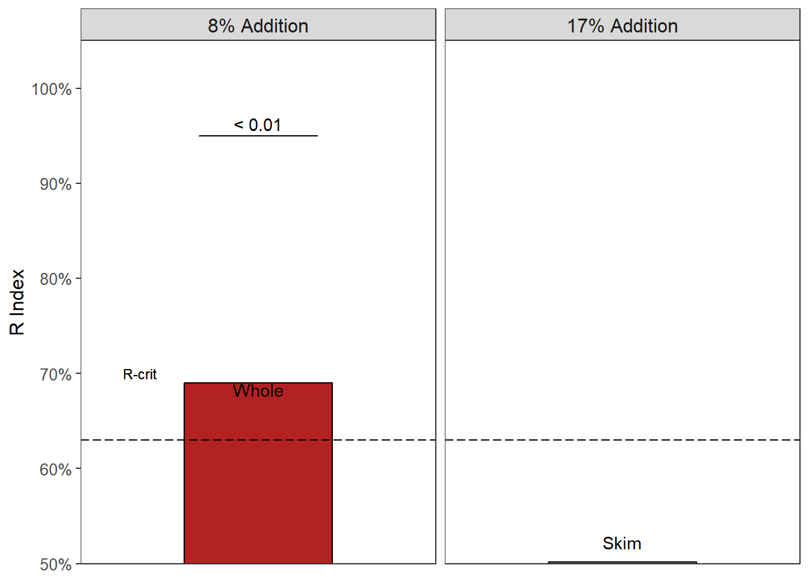

# 1:10 Sourness {#Sour10}

This will be the data analysis and results of the 1:10 nose closed study run in December 2024 and the 1:10 nose open study run in September 2023 on sourness.  
You can refer to the 1:10 Bitterness results [here](#Bitter10).  

A 1:10 brew strength (coffee:water, w/w) is representative of a strong ratio used by everyday consumers. Our hypotheses was:  

> Milk will reduce the sourness of cold brew coffee more than water  

This hypothesis is thought to be seen regardless of condition (nose closed or nose open). 

Some interpretations of expected data would be:

- In the nose closed condition a reduction in sourness from the milky coffee would suggest a physicochemical interaction between the milk and coffee  
- Milk, being 86% water [@walstraDairyTechnologyPrinciples1999] could have a similar effect as water would when added to coffee   
- In the nose opened condition, a reduction in sourness from the milky coffee could suggest a cross-modal interaction (particularly if no effect is seen in the nose closed condition) 

## Nose Closed Condition


### R Index  
 
The critical value for a 2-tailed test is **0.62**.  


- no discrimination seen between when 8% skim milk and 8% whole milk was added to coffee (R Index = 0.56, p > 0.05)  


- no discrimination between 17% skim milk or 17% whole milk added to coffee, (R Index = 0.51, p > 0.05)  


<div class="figure">

<p class="caption">(\#fig:study2ClosedMilkRViz)R Index of paired comparison between skim milk and whole milk at an 8% addition level and 17% addition level in a nose closed condition. Dashed horizontal line represents the critical value, which denotes statistical significance, or discrimination between the samples on sourness. Grey bars are not significant (p > 0.05). Red bars indicate the water sample ('Signal') was significant; White bars indicate the milk sample ('Noise') was significant (p < 0.05).</p>
</div>

For the paired comparisons between milk and water, we hypothesized that the addition of milk would reduce the sourness, therefore making the water sample the more sour. The critical value for a one tailed R-index calculation is **0.62**.  


- discrimination seen between when 8% skim milk and 8% water was added to coffee (R Index = 0.86, p $\le$ **0.001**)  

- discrimination seen between when 8% whole milk and 8% water was added to coffee (R Index = 0.75, p $\le$ **0.001**)   


- discrimination between the 17% skim milk and 17% water samples (R Index = 0.81, p $\le$ **0.001**)  
- discrimination between the 17% whole milk and 17% water samples (R Index = 0.86, p $\le$ **0.001**)  


<div class="figure">

<p class="caption">(\#fig:study2ClosedWaterRViz)R Index of paired comparison between skim milk and water at an 8% addition level and 17% addition level in a nose closed condition. Dashed horizontal line represents the critical value, which denotes statistical significance, or discrimination between the samples on sourness. Grey bars are not significant (p > 0.05). Red bars indicate the water sample ('Signal') was significant; White bars indicate the milk sample ('Noise') was significant (p < 0.05).</p>
</div>

- no discrimination seen between the sourness of skim milk or whole milk at either level (p > 0.05, see Figure \@ref(fig:study2ClosedWaterRViz))  
- milk, even at the 8% addition level, was able to be discriminated against the same amount of water added to the cold brew coffee (see Figure \@ref(fig:study2ClosedWaterRViz))

### Ratings  
The paired comparison will only show which sample is more sour (or discriminated against), without showing a magnitude of the difference. Thus, sourness intensity ratings were recorded as well. They will be analyzed by paired t-test with a Bonferroni correction against multiple comparisons.  


Table: (\#tab:study2KableClosedRatings)sourness intensities and standard error of cold brew coffee samples. Each 2 rows represent the two samples presented in a paired comparison format.

|Sample      | Intensity|        se|
|:-----------|---------:|---------:|
|sourness_13 |  3.516667| 0.4085884|
|sourness_15 |  3.600000| 0.4423033|
|sourness_14 |  3.150000| 0.3925674|
|sourness_17 |  5.083333| 0.3813793|
|sourness_16 |  3.566667| 0.4876246|
|sourness_18 |  5.033333| 0.3721121|
|sourness_19 |  3.583333| 0.4004906|
|sourness_21 |  3.900000| 0.4049975|
|sourness_20 |  3.783333| 0.3833333|
|sourness_23 |  5.133333| 0.4110075|
|sourness_22 |  4.250000| 0.4515300|
|sourness_24 |  4.916667| 0.3806251|


The Bonferroni corrected $\alpha$ would be 0.0167.


``` r
t.test(brew10closedsour$sourness_19, brew10closedsour$sourness_21, 
       paired = TRUE, alternative = "two.sided") 

	Paired t-test

data:  brew10closedsour$sourness_19 and brew10closedsour$sourness_21
t = -0.89985, df = 29, p-value = 0.3756
alternative hypothesis: true mean difference is not equal to 0
95 percent confidence interval:
 -1.0364044  0.4030711
sample estimates:
mean difference 
     -0.3166667 
t.test(brew10closedsour$sourness_23, brew10closedsour$sourness_20, 
paired = TRUE, alternative = "greater") #*

	Paired t-test

data:  brew10closedsour$sourness_23 and brew10closedsour$sourness_20
t = 4.0415, df = 29, p-value = 0.0001787
alternative hypothesis: true mean difference is greater than 0
95 percent confidence interval:
 0.7824294       Inf
sample estimates:
mean difference 
           1.35 
t.test(brew10closedsour$sourness_24, brew10closedsour$sourness_22, 
       paired = TRUE, alternative = "greater") #NS w/ Bonferroni

	Paired t-test

data:  brew10closedsour$sourness_24 and brew10closedsour$sourness_22
t = 1.7901, df = 29, p-value = 0.04194
alternative hypothesis: true mean difference is greater than 0
95 percent confidence interval:
 0.03387627        Inf
sample estimates:
mean difference 
      0.6666667 

t.test(brew10closedsour$sourness_13, brew10closedsour$sourness_15, 
       paired = TRUE, alternative = "two.sided")

	Paired t-test

data:  brew10closedsour$sourness_13 and brew10closedsour$sourness_15
t = -0.31206, df = 29, p-value = 0.7572
alternative hypothesis: true mean difference is not equal to 0
95 percent confidence interval:
 -0.6294987  0.4628321
sample estimates:
mean difference 
    -0.08333333 
t.test(brew10closedsour$sourness_17, brew10closedsour$sourness_14, 
paired = TRUE, alternative = "greater") #*

	Paired t-test

data:  brew10closedsour$sourness_17 and brew10closedsour$sourness_14
t = 5.5686, df = 29, p-value = 2.616e-06
alternative hypothesis: true mean difference is greater than 0
95 percent confidence interval:
 1.343424      Inf
sample estimates:
mean difference 
       1.933333 
t.test(brew10closedsour$sourness_18, brew10closedsour$sourness_16, 
paired = TRUE, alternative = "greater") #*

	Paired t-test

data:  brew10closedsour$sourness_18 and brew10closedsour$sourness_16
t = 3.7516, df = 29, p-value = 0.0003909
alternative hypothesis: true mean difference is greater than 0
95 percent confidence interval:
 0.8024074       Inf
sample estimates:
mean difference 
       1.466667 
```

- Ratings between the 8% skim milk and 8% whole milk were NSD (t = -0.9, p = 0.376)    
- Ratings between the 8% skim milk and 8% water were significantly different (t = 4.041, p = **1.8\times 10^{-4}**)  
- Ratings between the 8% whole milk and 8% water were NSD (t = 1.79, p = 0.04)  

-  Ratings between the 17% skim milk and 17% whole milk were NSD (t = -0.312, p = 0.76)  
- Ratings between the 17% skim milk and 8% water were significantly different (t = 5.569, p = **2.6\times 10^{-6}**)  
- Ratings between the 17% whole milk and 8% water were significantly different (t = 3.752, p = **3.9\times 10^{-4}**) 


<div class="figure">

<p class="caption">(\#fig:study2ClosedMilkRatingsViz)R Index of paired comparison between skim milk and whole milk at an 8% addition level and 17% addition level in a nose closed condition. Dashed horizontal line represents the critical value, which denotes statistical significance, or discrimination between the samples on sourness. Grey bars are not significant (p > 0.05). Red bars indicate the water sample ('Signal') was significant; White bars indicate the milk sample ('Noise') was significant (p < 0.05). sourness intensity ratings (from 0 - 10) are represented as violin plots showing the distribution of scaling responses. Means are presented as black dots with standard error bars.</p>
</div>


<div class="figure">

<p class="caption">(\#fig:study2ClosedWaterRatingsViz)R Index of paired comparison between skim milk and water at an 8% addition level and 17% addition level in a nose closed condition. Dashed horizontal line represents the critical value, which denotes statistical significance, or discrimination between the samples on sourness. Grey bars are not significant (p > 0.05). Red bars indicate the water sample ('Signal') was significant; White bars indicate the milk sample ('Noise') was significant (p < 0.05). sourness intensity ratings (from 0 - 10) are represented as violin plots showing the distribution of scaling responses. Means are presented as black dots with standard error bars.</p>
</div>

- no discrimination of sourness between comparisons of skim milk and whole milk (see Figure \@ref(fig:study2ClosedMilkRatingsViz))  
- discrimination seen between when water and milk was added to the cold brew (see Figure \@ref(fig:study2ClosedWaterRatingsViz))
  + the R index analysis showed discrimination, however only the ratings in the 8% skim milk v. water comparison were significant, p = **2\times 10^{-4}**

## Nose Open Condition


### R Index
The R critical value for a 2-tailed test (milk comparisons) is: **0.63**.  


- discrimination seen between when 8% skim milk and 8% whole milk was added to coffee (R Index = 0.69, p < **0.01**)  
    + interestingly, the skim milk sample (the "noise") was chosen more frequently than the whole milk sample (the "signal"): 22/34


- no discrimination seen between when 17% skim milk and 17% whole milk was added to coffee (R Index = 0.5, p > 0.05)  


<div class="figure">

<p class="caption">(\#fig:study2OpenMilkRViz)R Index of paired comparison between skim milk and whole milk at an 8% addition level and 17% addition level in a nose open condition. Dashed horizontal line represents the critical value, which denotes statistical significance, or discrimination between the samples on sourness. Grey bars are not significant (p > 0.05). Red bars indicate the water sample ('Signal') was significant; White bars indicate the milk sample ('Noise') was significant (p < 0.05).</p>
</div>

For the paired comparisons between milk and water, we hypothesized that the addition of milk would reduce the sourness, therefore making the water sample the more sour. The critical value for a one tailed R-index calculation is 0.61.  


- discrimination seen between when 8% skim milk and 8% water was added to coffee (R Index = 0.79, p $\le$ **0.001**)  
- discrimination seen between when 8% whole milk and 8% water was added to coffee (R Index = 0.77, p $\le$ **0.001**)   


- discrimination between the 17% skim milk and 17% water samples (R Index = 0.75, p $\le$ **0.001**)  
- discrimination seen between the 17% whole milk and 17% water samples (R Index = 0.83, p $\le$ **0.001**)  


<div class="figure">

<p class="caption">(\#fig:study2OpenedWaterRViz)R Index of paired comparison between skim milk and water at an 8% addition level and 17% addition level in a nose opened condition. Dashed horizontal line represents the critical value, which denotes statistical significance, or discrimination between the samples on sourness. Grey bars are not significant (p > 0.05). Red bars indicate the water sample ('Signal') was significant; White bars indicate the milk sample ('Noise') was significant (p < 0.05).</p>
</div>

- In the nose open condition, all samples were discriminated against the water sample.  

### Ratings  


Table: (\#tab:study2KableOpenRatings)sourness intensities and standard error of cold brew coffee samples evaluated in nose opened condition. Each 2 rows represent the two samples presented in a paired comparison format.

|Sample      | Intensity|        se|
|:-----------|---------:|---------:|
|sourness_13 |  3.138235| 0.3620848|
|sourness_15 |  3.205882| 0.3581728|
|sourness_14 |  3.250000| 0.2857660|
|sourness_17 |  4.250000| 0.3352773|
|sourness_16 |  2.970588| 0.3601725|
|sourness_18 |  4.255882| 0.2893903|
|sourness_19 |  3.570588| 0.3639389|
|sourness_21 |  2.973529| 0.3192937|
|sourness_20 |  3.564706| 0.3503215|
|sourness_23 |  4.323529| 0.3600371|
|sourness_22 |  3.588235| 0.2966469|
|sourness_24 |  4.379412| 0.3343331|


``` r
t.test(df10openedSour$sourness_19, df10openedSour$sourness_21, 
       paired = TRUE, alternative = "two.sided") 

	Paired t-test

data:  df10openedSour$sourness_19 and df10openedSour$sourness_21
t = 1.9542, df = 33, p-value = 0.05919
alternative hypothesis: true mean difference is not equal to 0
95 percent confidence interval:
 -0.02452467  1.21864232
sample estimates:
mean difference 
      0.5970588 
t.test(df10openedSour$sourness_23, df10openedSour$sourness_20, 
paired = TRUE, alternative = "greater") #*

	Paired t-test

data:  df10openedSour$sourness_23 and df10openedSour$sourness_20
t = 2.5642, df = 33, p-value = 0.007541
alternative hypothesis: true mean difference is greater than 0
95 percent confidence interval:
 0.2579939       Inf
sample estimates:
mean difference 
      0.7588235 
t.test(df10openedSour$sourness_24, df10openedSour$sourness_22, 
paired = TRUE, alternative = "greater") #*

	Paired t-test

data:  df10openedSour$sourness_24 and df10openedSour$sourness_22
t = 2.6524, df = 33, p-value = 0.006095
alternative hypothesis: true mean difference is greater than 0
95 percent confidence interval:
 0.2863743       Inf
sample estimates:
mean difference 
      0.7911765 

t.test(df10openedSour$sourness_13, df10openedSour$sourness_15, 
       paired = TRUE, alternative = "two.sided")

	Paired t-test

data:  df10openedSour$sourness_13 and df10openedSour$sourness_15
t = -0.22781, df = 33, p-value = 0.8212
alternative hypothesis: true mean difference is not equal to 0
95 percent confidence interval:
 -0.6717879  0.5364938
sample estimates:
mean difference 
    -0.06764706 
t.test(df10openedSour$sourness_17, df10openedSour$sourness_14, 
paired = TRUE, alternative = "greater") #*

	Paired t-test

data:  df10openedSour$sourness_17 and df10openedSour$sourness_14
t = 2.8829, df = 33, p-value = 0.003442
alternative hypothesis: true mean difference is greater than 0
95 percent confidence interval:
 0.412966      Inf
sample estimates:
mean difference 
              1 
t.test(df10openedSour$sourness_18, df10openedSour$sourness_16, 
paired = TRUE, alternative = "greater") #*

	Paired t-test

data:  df10openedSour$sourness_18 and df10openedSour$sourness_16
t = 3.7461, df = 33, p-value = 0.0003438
alternative hypothesis: true mean difference is greater than 0
95 percent confidence interval:
 0.7046376       Inf
sample estimates:
mean difference 
       1.285294 
```

- NSD between 8% skim and whole milk (t = 1.95, p = 0.06)
- significant reduction in sourness between 8% skim and 8% water ratings (t = 4.16, p = **0.0075**)  
- significant reduction between 8% whole milk and 8% water ratings (t = 2.65, p = **0.0061**)  

- NSD between 17% skim and 17% whole milk ratings (t = -0.23, p = 0.82)  
- significant reduction in sourness between 17% skim and 17% water ratings (t = 2.88, p = **0.0034**)  
- significant reduction between 17% whole milk and 17% water ratings (t = 3.75, p = **3.4\times 10^{-4}**)  


<div class="figure">

<p class="caption">(\#fig:study2OpenedMilkRatingsViz)R Index of paired comparison between skim milk and whole milk at an 8% addition level and 17% addition level in a nose opened condition. Dashed horizontal line represents the critical value, which denotes statistical significance, or discrimination between the samples on sourness. Grey bars are not significant (p > 0.05). Red bars indicate the water sample ('Signal') was significant; White bars indicate the milk sample ('Noise') was significant (p < 0.05). sourness intensity ratings (from 0 - 10) are represented as violin plots showing the distribution of scaling responses. Means are presented as black dots with standard error bars.</p>
</div>


<div class="figure">

<p class="caption">(\#fig:study2OpenedWaterViZ)R Index of paired comparison between skim milk and water at an 8% addition level and 17% addition level in a nose opened condition. Dashed horizontal line represents the critical value, which denotes statistical significance, or discrimination between the samples on sourness. Grey bars are not significant (p > 0.05). Red bars indicate the water sample ('Signal') was significant; White bars indicate the milk sample ('Noise') was significant (p < 0.05). sourness intensity ratings (from 0 - 10) are represented as violin plots showing the distribution of scaling responses. Means are presented as black dots with standard error bars.</p>
</div>

## Comparison of Conditions


<div class="figure">

<p class="caption">(\#fig:study2MilkCombineRViz)R Index of paired comparison between skim milk and whole milk at an 8% addition level and 17% addition level in a nose closed and nose opened condition. Dashed horizontal line represents the critical value, which denotes statistical significance, or discrimination between the samples on sourness. Grey bars are not significant (p > 0.05). Red bars indicate the water sample (‘Signal’) was significant; White bars indicate the milk sample (‘Noise’) was significant (p < 0.05).</p>
</div>


<div class="figure">

<p class="caption">(\#fig:study2WaterCombineRViz)R Index of paired comparison between skim milk, whole milk, and water at an 8% addition level and 17% addition level in a nose closed and nose opened condition. Dashed horizontal line represents the critical value, which denotes statistical significance, or discrimination between the samples on sourness. Grey bars are not significant (p > 0.05). Red bars indicate the water sample (‘Signal’) was significant; White bars indicate the milk sample (‘Noise’) was significant (p < 0.05).</p>
</div>

- Figure \@ref(fig:study2WaterCombineRViz) continues to present interesting data in the nose closed condition when testing the 8% Addition comparisons (cf. Figure \@ref(fig:study2MilkCombineRViz))  
    + the skim milk sample was chosen as the more sour sample compared to the same amount (8%) of water (white bar)  
    + the whole milk sample was chosen as the less sour sample compared to water (red bar)  
- Neither of these effects are seen in the nose opened condition
    + this data does not look at the possibility of removing panelists in the nose closed condition that responded that they were not regular coffee drinkers in the demographic questions. It may be of interest to see how/if the data changes when removing them (or segmenting them).  

## Notes {-}
<input type="checkbox"> examine the participant data  
  - do panelists need to be excluded because they do not meet inclusion criteria?  
<input type="checkbox"> update Rindex figures like Chris described  
<input type="checkbox"> resolve `warnings()`?

## References {-}
