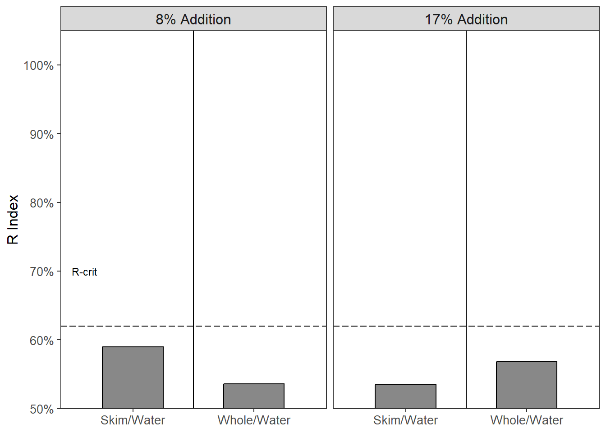
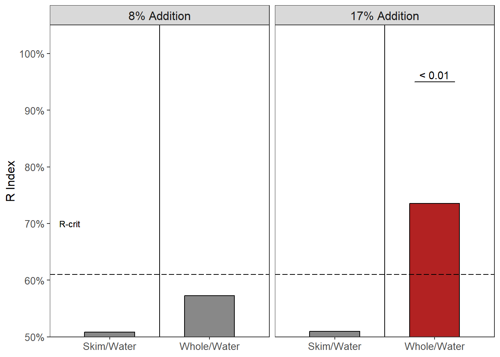

# 1:5 Bitterness {#Bitter5}

This will be the data analysis and results of the 1:5 nose closed study run in March 2023 and the 1:5 nose open study run in September 2023.  

See the 1:10 brew strength bitter analysis [here](#Bitter10). 

A 1:10 brew strength (coffee:water, w/w) is representative of a strong ratio used by everyday consumers. Our hypotheses was:  

> Milk will reduce the bitterness of cold brew coffee more than water  

This hypothesis is thought to be seen regardless of condition (nose closed or nose open). 

Some interpretations of expected data would be:

- In the nose closed condition a reduction in bitterness from the milky coffee would suggest a physicochemical interaction between the milk and coffee  
- Milk, being 86% water [@walstraDairyTechnologyPrinciples1999] could have a similar effect as water would when added to coffee   
- In the nose opened condition, a reduction in bitterness from the milky coffee could suggest a cross-modal interaction (particularly if no effect is seen in the nose closed condition) 

## Nose Closed Condition


### Participant Data

``` r
Study3Meta <- read_xlsx(path = "Objective1CompiledDataWithIndex.xlsx", sheet = 6) %>% clean_names()
colnames(Study3Meta)
```

```
##  [1] "panelist_code"        "age"                  "gender"              
##  [4] "indian_alaska_native" "asian"                "black"               
##  [7] "white"                "latinx"               "other"               
## [10] "other_comment"        "consumption"          "sweetener"           
## [13] "sweetener_comment"    "whitener"             "whitener_comment"    
## [16] "quantity_whitener"
```

``` r
Study3Meta %>% filter(consumption == "6") #osu24
```

```
## # A tibble: 1 × 16
##   panelist_code   age gender indian_alaska_native asian black white latinx other
##   <chr>         <dbl>  <dbl>                <dbl> <dbl> <dbl> <dbl>  <dbl> <dbl>
## 1 osu24            27      2                    0     1     0     0      0     0
## # ℹ 7 more variables: other_comment <chr>, consumption <dbl>, sweetener <dbl>,
## #   sweetener_comment <chr>, whitener <dbl>, whitener_comment <chr>,
## #   quantity_whitener <dbl>
```

``` r
# 1 - daily; 2 - 2-3/wk; 3- 1/wk
# 4 - 2-3/mo; 5 - 1/mo; 6 <1/mo

describe(Study3Meta)[2, ] #%>% select(mean, sd, median, min, max) #age
```

```
## Study3Meta 
## 
##  1  Variables      32  Observations
## --------------------------------------------------------------------------------
## age 
##        n  missing distinct     Info     Mean  pMedian      Gmd      .05 
##       32        0       13    0.987    27.09       26    5.607    22.00 
##      .10      .25      .50      .75      .90      .95 
##    23.00    24.00    25.00    29.00    32.00    34.35 
##                                                                             
## Value         21    22    23    24    25    26    27    29    31    32    33
## Frequency      1     2     4     6     4     4     2     2     2     2     1
## Proportion 0.031 0.062 0.125 0.188 0.125 0.125 0.062 0.062 0.062 0.062 0.031
##                       
## Value         36    55
## Frequency      1     1
## Proportion 0.031 0.031
## 
## For the frequency table, variable is rounded to the nearest 0
## --------------------------------------------------------------------------------
```

``` r
Study3Meta %>% count(gender) # 10 males, 24 females
```

```
## # A tibble: 2 × 2
##   gender     n
##    <dbl> <int>
## 1      1     9
## 2      2    23
```

``` r
Study3Meta %>% group_by(sweetener, whitener) %>% 
  tally() %>% 
  spread(whitener, n) %>% 
  replace(is.na(.), 0)
```

```
## # A tibble: 2 × 3
## # Groups:   sweetener [2]
##   sweetener   `1`   `2`
##       <dbl> <int> <int>
## 1         1    21     1
## 2         2     8     2
```

``` r
# 11 - whiten and sweeten
# 12 - whiten, no sweeten
# 21 - sweeten, no whiten
# 22 - black coffee drinker

Study3Meta %>% count(consumption)
```

```
## # A tibble: 5 × 2
##   consumption     n
##         <dbl> <int>
## 1           1    20
## 2           2     6
## 3           3     2
## 4           4     3
## 5           6     1
```

``` r
# 1 - daily; 2 - 2-3/wk; 3- 1/wk
# 4 - 2-3/mo; 5 - 1/mo; 6 <1/mo
```

- remove one participant (F) because they did not meet inclusion criteria 


### R Index  
In the paired comparisons between when skim milk or whole milk was added to the coffee, there is not enough evidence to suggest one will reduce the bitterness more than the other [cf. @keastModificationBitternessCaffeine2008].  
The critical value for a 2-tailed test is **0.62**.  


- no discrimination seen between when 8% skim milk and 8% whole milk was added to coffee (R Index = 0.57, p > 0.05)  


- no discrimination between 17% skim milk or 17% whole milk added to coffee, (R Index = 0.58, p > 0.05)  


<div class="figure">

<p class="caption">(\#fig:study3ClosedMilkRViz)R Index of paired comparison between skim milk and whole milk at an 8% addition level and 17% addition level in a nose closed condition. Dashed horizontal line represents the critical value, which denotes statistical significance, or discrimination between the samples on bitterness. Grey bars are not significant (p > 0.05). Red bars indicate the water sample ('Signal') was significant; White bars indicate the milk sample ('Noise') was significant (p < 0.05).</p>
</div>

For the paired comparisons between milk and water, we hypothesized that the addition of milk would reduce the bitterness, therefore making the water sample the more bitter. The critical value for a one tailed R-index calculation is **0.62**.  


- no discrimination seen between when 8% skim milk and 8% water was added to coffee (R Index = 0.59, p > 0.05)  

- no discrimination seen between when 8% whole milk and 8% water was added to coffee (R Index = 0.54, p > 0.05)   


- no discrimination between the 17% skim milk and 17% water samples (R Index = 0.53, p > 0.05)  
- no discrimination between the 17% whole milk and 17% water samples (R Index = 0.57, p > 0.05)  


<div class="figure">

<p class="caption">(\#fig:study3ClosedWaterRViz)R Index of paired comparison between skim milk and water at an 8% addition level and 17% addition level in a nose closed condition. Dashed horizontal line represents the critical value, which denotes statistical significance, or discrimination between the samples on bitterness. Grey bars are not significant (p > 0.05). Red bars indicate the water sample ('Signal') was significant; White bars indicate the milk sample ('Noise') was significant (p < 0.05).</p>
</div>

- No discrimination was seen at either the 8% or 17% addition levels  
  + To me, this calls into question Figure \@ref(fig:study1ClosedWaterRViz) 

### Ratings  
The paired comparison will only show which sample is more bitter (or discriminated against), without showing a magnitude of the difference. Thus, bitterness intensity ratings were recorded as well. They will be analyzed by paired t-test with a Bonferroni correction against multiple comparisons.  


Table: (\#tab:study3KableClosedRatings)Bitterness intensities, standard deviation, and standard error of cold brew coffee samples. Each 2 rows represent the two samples presented in a paired comparison format.

|Sample        | Intensity|       sd|        se|
|:-------------|---------:|--------:|---------:|
|bitterness_1  |  5.548387| 1.980551| 0.3557174|
|bitterness_3  |  5.709677| 1.824711| 0.3277278|
|bitterness_2  |  5.830645| 2.093031| 0.3759195|
|bitterness_5  |  5.774193| 2.072996| 0.3723210|
|bitterness_4  |  5.503226| 2.345987| 0.4213517|
|bitterness_6  |  6.000000| 2.109502| 0.3788778|
|bitterness_7  |  6.483871| 2.131056| 0.3827489|
|bitterness_9  |  5.903226| 1.959674| 0.3519679|
|bitterness_8  |  6.225807| 1.896658| 0.3406498|
|bitterness_11 |  5.758064| 1.948807| 0.3500161|
|bitterness_10 |  5.846774| 2.070303| 0.3718375|
|bitterness_12 |  6.000000| 2.284002| 0.4102189|


The Bonferroni corrected $\alpha$ would be **0.0167**.


``` r
t.test(df5closed$bitterness_7, df5closed$bitterness_9, 
       paired = TRUE, alternative = "two.sided") 

	Paired t-test

data:  df5closed$bitterness_7 and df5closed$bitterness_9
t = 1.6437, df = 30, p-value = 0.1107
alternative hypothesis: true mean difference is not equal to 0
95 percent confidence interval:
 -0.1407808  1.3020711
sample estimates:
mean difference 
      0.5806452 
t.test(df5closed$bitterness_11, df5closed$bitterness_8, 
       paired = TRUE, alternative = "greater")

	Paired t-test

data:  df5closed$bitterness_11 and df5closed$bitterness_8
t = -1.3602, df = 30, p-value = 0.9081
alternative hypothesis: true mean difference is greater than 0
95 percent confidence interval:
 -1.051375       Inf
sample estimates:
mean difference 
     -0.4677419 
t.test(df5closed$bitterness_12, df5closed$bitterness_10, 
       paired = TRUE, alternative = "greater")

	Paired t-test

data:  df5closed$bitterness_12 and df5closed$bitterness_10
t = 0.40969, df = 30, p-value = 0.3425
alternative hypothesis: true mean difference is greater than 0
95 percent confidence interval:
 -0.4815498        Inf
sample estimates:
mean difference 
      0.1532258 

t.test(df5closed$bitterness_1, df5closed$bitterness_3, 
       paired = TRUE, alternative = "two.sided")

	Paired t-test

data:  df5closed$bitterness_1 and df5closed$bitterness_3
t = -0.43191, df = 30, p-value = 0.6689
alternative hypothesis: true mean difference is not equal to 0
95 percent confidence interval:
 -0.9239511  0.6013704
sample estimates:
mean difference 
     -0.1612903 
t.test(df5closed$bitterness_5, df5closed$bitterness_2, 
       paired = TRUE, alternative = "greater")

	Paired t-test

data:  df5closed$bitterness_5 and df5closed$bitterness_2
t = -0.18844, df = 30, p-value = 0.5741
alternative hypothesis: true mean difference is greater than 0
95 percent confidence interval:
 -0.5649106        Inf
sample estimates:
mean difference 
    -0.05645161 
t.test(df5closed$bitterness_6, df5closed$bitterness_4, 
       paired = TRUE, alternative = "greater")

	Paired t-test

data:  df5closed$bitterness_6 and df5closed$bitterness_4
t = 1.2255, df = 30, p-value = 0.115
alternative hypothesis: true mean difference is greater than 0
95 percent confidence interval:
 -0.1912165        Inf
sample estimates:
mean difference 
      0.4967742 
```

- Ratings between the 8% skim milk and 8% whole milk were NSD (t = 1.644, p = 0.11) 
- Ratings between the 8% skim milk and 8% water were NSD (t = -1.36, p = 0.91) 
- Ratings between the 8% whole milk and 8% water were NSD (t = 0.41, p = 0.34) 

- Ratings between the 17% skim milk and 17% whole milk were NSD (t = -0.432, p = 0.67)
- Ratings between the 17% skim milk and 17% water were NSD (t = -0.188, p = 0.57)  
- Ratings between the 17% whole milk and 17% water were NSD (t = 1.226, p = 0.11) 


<div class="figure">

<p class="caption">(\#fig:study3ClosedMilkRatingsViz)R Index of paired comparison between skim milk and whole milk at an 8% addition level and 17% addition level in a nose closed condition. Dashed horizontal line represents the critical value, which denotes statistical significance, or discrimination between the samples on bitterness. Grey bars are not significant (p > 0.05). Red bars indicate the water sample ('Signal') was significant; White bars indicate the milk sample ('Noise') was significant (p < 0.05). Bitterness intensity ratings (from 0 - 10) are represented as violin plots showing the distribution of scaling responses. Means are presented as black dots with standard error bars.</p>
</div>


<div class="figure">

<p class="caption">(\#fig:study3ClosedWaterRatingsViz)R Index of paired comparison between skim milk and water at an 8% addition level and 17% addition level in a nose closed condition. Dashed horizontal line represents the critical value, which denotes statistical significance, or discrimination between the samples on bitterness. Grey bars are not significant (p > 0.05). Red bars indicate the water sample ('Signal') was significant; White bars indicate the milk sample ('Noise') was significant (p < 0.05). Bitterness intensity ratings (from 0 - 10) are represented as violin plots showing the distribution of scaling responses. Means are presented as black dots with standard error bars.</p>
</div>

## Nose Open Condition
### Participant Data 

``` r
Study3MetaOpen <- read_xlsx(path = "Objective1CompiledDataWithIndex.xlsx", sheet = 13) %>% clean_names()
colnames(Study3MetaOpen)
```

```
##  [1] "panelist_code"         "age"                   "gender"               
##  [4] "indian_alaskan"        "asian_indian_islander" "black"                
##  [7] "hispanic_latino"       "white"                 "other"                
## [10] "race_comment"          "consumption"           "sweetener"            
## [13] "sweetener_comments"    "whitener"              "whitener_comments"    
## [16] "how_white"
```

``` r
Study3MetaOpen %>% filter(consumption == "6") 
```

```
## # A tibble: 0 × 16
## # ℹ 16 variables: panelist_code <chr>, age <dbl>, gender <dbl>,
## #   indian_alaskan <dbl>, asian_indian_islander <dbl>, black <dbl>,
## #   hispanic_latino <dbl>, white <dbl>, other <dbl>, race_comment <chr>,
## #   consumption <dbl>, sweetener <dbl>, sweetener_comments <chr>,
## #   whitener <dbl>, whitener_comments <chr>, how_white <dbl>
```

``` r
# 1 - daily; 2 - 2-3/wk; 3- 1/wk
# 4 - 2-3/mo; 5 - 1/mo; 6 <1/mo

describe(Study3MetaOpen)[2, ] #%>% select(mean, sd, median, min, max) #age
```

```
## Study3MetaOpen 
## 
##  1  Variables      34  Observations
## --------------------------------------------------------------------------------
## age 
##        n  missing distinct     Info     Mean  pMedian      Gmd      .05 
##       34        0       15    0.991    29.15       27    8.323    22.65 
##      .10      .25      .50      .75      .90      .95 
##    23.00    24.00    26.00    30.00    32.70    41.20 
##                                                                             
## Value         22    23    24    25    26    27    28    29    30    31    32
## Frequency      2     4     5     5     2     2     2     2     2     2     2
## Proportion 0.059 0.118 0.147 0.147 0.059 0.059 0.059 0.059 0.059 0.059 0.059
##                                   
## Value         33    37    49    85
## Frequency      1     1     1     1
## Proportion 0.029 0.029 0.029 0.029
## 
## For the frequency table, variable is rounded to the nearest 0
## --------------------------------------------------------------------------------
```

``` r
Study3MetaOpen %>% count(gender) # 10 males, 24 females
```

```
## # A tibble: 2 × 2
##   gender     n
##    <dbl> <int>
## 1      1    10
## 2      2    24
```

``` r
Study3MetaOpen %>% group_by(sweetener, whitener) %>% 
  tally() %>% 
  spread(whitener, n) %>% 
  replace(is.na(.), 0)
```

```
## # A tibble: 2 × 3
## # Groups:   sweetener [2]
##   sweetener   `1`   `2`
##       <dbl> <int> <int>
## 1         1    17     1
## 2         2    11     5
```

``` r
# 11 - whiten and sweeten
# 12 - whiten, no sweeten
# 21 - sweeten, no whiten
# 22 - black coffee drinker

Study3MetaOpen %>% count(consumption)
```

```
## # A tibble: 5 × 2
##   consumption     n
##         <dbl> <int>
## 1           1    18
## 2           2    10
## 3           3     1
## 4           4     3
## 5           5     2
```

``` r
# 1 - daily; 2 - 2-3/wk; 3- 1/wk
# 4 - 2-3/mo; 5 - 1/mo; 6 <1/mo
```


### R Index
The R critical value for a 2-tailed test (milk comparisons) is: **0.63**.  


- no discrimination seen between when 8% skim milk and 8% whole milk was added to coffee (R Index = 0.52, p > 0.05)  


- no discrimination seen between when 17% skim milk and 17% whole milk was added to coffee (R Index = 0.57, p > 0.05)  


<div class="figure">

<p class="caption">(\#fig:study3OpenMilkRViz)R Index of paired comparison between skim milk and whole milk at an 8% addition level and 17% addition level in a nose open condition. Dashed horizontal line represents the critical value, which denotes statistical significance, or discrimination between the samples on bitterness. Grey bars are not significant (p > 0.05). Red bars indicate the water sample ('Signal') was significant; White bars indicate the milk sample ('Noise') was significant (p < 0.05).</p>
</div>

For the paired comparisons between milk and water, we hypothesized that the addition of milk would reduce the bitterness, therefore making the water sample the more bitter. The critical value for a one tailed R-index calculation is 0.61.  


- no discrimination seen between when 8% skim milk and 8% water was added to coffee (R Index = 0.51, p > 0.05)  
- no discrimination seen between when 8% whole milk and 8% water was added to coffee (R Index = 0.573, p > 0.1)   


- no discrimination between the 17% skim milk and 17% water samples (R Index = 0.51, p > 0.05)  
- discrimination seen between the 17% whole milk and 17% water samples (R Index = 0.74, p $\le$ **0.001**)  


<div class="figure">

<p class="caption">(\#fig:study3OpenedWaterRViz)R Index of paired comparison between skim milk and water at an 8% addition level and 17% addition level in a nose opened condition. Dashed horizontal line represents the critical value, which denotes statistical significance, or discrimination between the samples on bitterness. Grey bars are not significant (p > 0.05). Red bars indicate the water sample ('Signal') was significant; White bars indicate the milk sample ('Noise') was significant (p < 0.05).</p>
</div>

- In the nose open condition, only the 17% water sample was discriminated against the 17% whole milk sample on bitterness.  
  + These two samples were not discriminated in the nose closed condition (see \@ref(fig:study3ClosedWaterRViz))  

### Ratings  


Table: (\#tab:study3KableOpenRatings)Bitterness intensities, standard deviation, and standard error of cold brew coffee samples evaluated in nose opened condition. Each 2 rows represent the two samples presented in a paired comparison format.

|Sample        | Intensity|       sd|        se|
|:-------------|---------:|--------:|---------:|
|bitterness_1  |  6.088235| 1.653603| 0.2835906|
|bitterness_3  |  5.808823| 1.992466| 0.3417051|
|bitterness_2  |  5.967647| 1.929629| 0.3309286|
|bitterness_5  |  6.088235| 1.908794| 0.3273554|
|bitterness_4  |  5.520588| 1.983077| 0.3400949|
|bitterness_6  |  6.426471| 1.950650| 0.3345337|
|bitterness_7  |  6.205882| 1.813742| 0.3110542|
|bitterness_9  |  6.220588| 1.771796| 0.3038605|
|bitterness_8  |  5.994118| 1.672766| 0.2868770|
|bitterness_11 |  5.911765| 1.802652| 0.3091523|
|bitterness_10 |  5.929412| 2.340620| 0.4014130|
|bitterness_12 |  6.352941| 1.920896| 0.3294309|


``` r
t.test(df5opened$bitterness_7, df5opened$bitterness_9, 
       paired = TRUE, alternative = "two.sided") 

	Paired t-test

data:  df5opened$bitterness_7 and df5opened$bitterness_9
t = -0.041302, df = 33, p-value = 0.9673
alternative hypothesis: true mean difference is not equal to 0
95 percent confidence interval:
 -0.7391076  0.7096958
sample estimates:
mean difference 
    -0.01470588 
t.test(df5opened$bitterness_11, df5opened$bitterness_8, 
       paired = TRUE, alternative = "greater")

	Paired t-test

data:  df5opened$bitterness_11 and df5opened$bitterness_8
t = -0.28868, df = 33, p-value = 0.6127
alternative hypothesis: true mean difference is greater than 0
95 percent confidence interval:
 -0.5651384        Inf
sample estimates:
mean difference 
    -0.08235294 
t.test(df5opened$bitterness_12, df5opened$bitterness_10, 
       paired = TRUE, alternative = "greater")

	Paired t-test

data:  df5opened$bitterness_12 and df5opened$bitterness_10
t = 1.3283, df = 33, p-value = 0.09659
alternative hypothesis: true mean difference is greater than 0
95 percent confidence interval:
 -0.1160624        Inf
sample estimates:
mean difference 
      0.4235294 

t.test(df5opened$bitterness_1, df5opened$bitterness_3, 
       paired = TRUE, alternative = "two.sided")

	Paired t-test

data:  df5opened$bitterness_1 and df5opened$bitterness_3
t = 0.84529, df = 33, p-value = 0.404
alternative hypothesis: true mean difference is not equal to 0
95 percent confidence interval:
 -0.3931032  0.9519267
sample estimates:
mean difference 
      0.2794118 
t.test(df5opened$bitterness_5, df5opened$bitterness_2, 
       paired = TRUE, alternative = "greater")

	Paired t-test

data:  df5opened$bitterness_5 and df5opened$bitterness_2
t = 0.31972, df = 33, p-value = 0.3756
alternative hypothesis: true mean difference is greater than 0
95 percent confidence interval:
 -0.5177253        Inf
sample estimates:
mean difference 
      0.1205882 
t.test(df5opened$bitterness_6, df5opened$bitterness_4, 
       paired = TRUE, alternative = "greater")

	Paired t-test

data:  df5opened$bitterness_6 and df5opened$bitterness_4
t = 2.3236, df = 33, p-value = 0.01323
alternative hypothesis: true mean difference is greater than 0
95 percent confidence interval:
 0.2460889       Inf
sample estimates:
mean difference 
      0.9058824 
```

- NSD between 8% skim and whole milk (t = -0.04, p = 0.967)
- NSD between 8% skim and 8% water ratings (t = -0.29, p = 0.61)  
- NSD between 8% whole milk and 8% water ratings (t = -1.33, p = 0.097)  

- NSD between 17% skim and 17% whole milk ratings (t = 0.85, p = 0.4)  
- NSD between 17% skim and 17% water ratings (t = 0.32, p = 0.38)  
- significant reduction between 17% whole milk and 17% water ratings (t = 2.32, p = **0.013**)  


<div class="figure">

<p class="caption">(\#fig:study3OpenedMilkRatingsViz)R Index of paired comparison between skim milk and whole milk at an 8% addition level and 17% addition level in a nose opened condition. Dashed horizontal line represents the critical value, which denotes statistical significance, or discrimination between the samples on bitterness. Grey bars are not significant (p > 0.05). Red bars indicate the water sample ('Signal') was significant; White bars indicate the milk sample ('Noise') was significant (p < 0.05). Bitterness intensity ratings (from 0 - 10) are represented as violin plots showing the distribution of scaling responses. Means are presented as black dots with standard error bars.</p>
</div>


<div class="figure">

<p class="caption">(\#fig:study3OpenedWaterRatingsViz)R Index of paired comparison between skim milk and water at an 8% addition level and 17% addition level in a nose opened condition. Dashed horizontal line represents the critical value, which denotes statistical significance, or discrimination between the samples on bitterness. Grey bars are not significant (p > 0.05). Red bars indicate the water sample ('Signal') was significant; White bars indicate the milk sample ('Noise') was significant (p < 0.05). Bitterness intensity ratings (from 0 - 10) are represented as violin plots showing the distribution of scaling responses. Means are presented as black dots with standard error bars.</p>
</div>

## Comparison of Conditions


<div class="figure">

<p class="caption">(\#fig:study3MilkCombineRViz)R Index of paired comparison between skim milk and whole milk at an 8% addition level and 17% addition level in a nose closed and nose opened condition. Dashed horizontal line represents the critical value, which denotes statistical significance, or discrimination between the samples on bitterness. Grey bars are not significant (p > 0.05). Red bars indicate the water sample (‘Signal’) was significant; White bars indicate the milk sample (‘Noise’) was significant (p < 0.05).</p>
</div>

- Figure \@ref(fig:study3MilkCombineRViz) shows no discrimination in bitterness between when skim milk or whole milk was added to cold brew coffee concentrate  


<div class="figure">

<p class="caption">(\#fig:study3WaterCombineRViz)R Index of paired comparison between skim milk, whole milk, and water at an 8% addition level and 17% addition level in a nose closed and nose opened condition. Dashed horizontal line represents the critical value, which denotes statistical significance, or discrimination between the samples on bitterness. Grey bars are not significant (p > 0.05). Red bars indicate the water sample (‘Signal’) was significant; White bars indicate the milk sample (‘Noise’) was significant (p < 0.05).</p>
</div>

- Figure \@ref(fig:study3WaterCombineRViz) shows that only the 17% whole milk was able to be discriminated from the 17% water addition.
  + how does this compare to **Figure \@ref(fig:study1WaterCombineRViz)**?

## Notes {-}
<input type="checkbox"> update Rindex figures like Chris described  
<input type="checkbox"> resolve `warnings()`?
<input type="checkbox"> resolve study 1 figure reference
