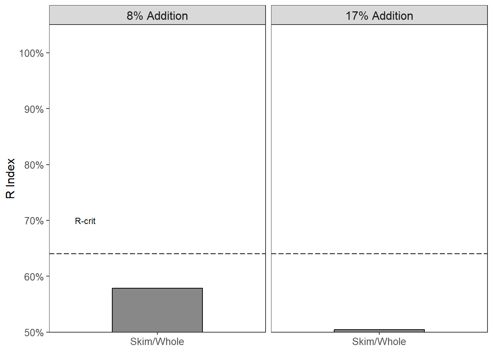

# 1:5 Sourness {#Sour5}

This will be the data analysis and results of the 1:5 nose closed study run in November 2023 and the 1:5 nose open study run in September 2023 on sourness.  
You can refer to the 1:5 Bitterness results [here](#Bitter5).  

A 1:10 brew strength (coffee:water, w/w) is representative of a strong ratio used by everyday consumers. Our hypotheses was:  

> Milk will reduce the sourness of cold brew coffee more than water  

This hypothesis is thought to be seen regardless of condition (nose closed or nose open). 

Some interpretations of expected data would be:

- In the nose closed condition a reduction in sourness from the milky coffee would suggest a physicochemical interaction between the milk and coffee  
- Milk, being 86% water [@walstraDairyTechnologyPrinciples1999] could have a similar effect as water would when added to coffee   
- In the nose opened condition, a reduction in sourness from the milky coffee could suggest a cross-modal interaction (particularly if no effect is seen in the nose closed condition) 

## Nose Closed Condition


### R Index  
 
The critical value for a 2-tailed test is **0.62**.  


- no discrimination seen between when 8% skim milk and 8% whole milk was added to coffee (R Index = 0.58, p > 0.05)  


- no discrimination between 17% skim milk or 17% whole milk added to coffee, (R Index = 0.5, p > 0.05)  


<div class="figure">

<p class="caption">(\#fig:study4ClosedMilkRViz)R Index of paired comparison between skim milk and whole milk at an 8% addition level and 17% addition level in a nose closed condition. Dashed horizontal line represents the critical value, which denotes statistical significance, or discrimination between the samples on sourness. Grey bars are not significant (p > 0.05). Red bars indicate the water sample ('Signal') was significant; White bars indicate the milk sample ('Noise') was significant (p < 0.05).</p>
</div>

For the paired comparisons between milk and water, we hypothesized that the addition of milk would reduce the sourness, therefore making the water sample the more sour. The critical value for a one tailed R-index calculation is 0.62.  


- discrimination seen between when 8% skim milk and 8% water was added to coffee (R Index = 0.77, p $\le$ **0.001**)  

- no discrimination seen between when 8% whole milk and 8% water was added to coffee (R Index = 0.58, p > 0.05)   


- discrimination between the 17% skim milk and 17% water samples (R Index = 0.78, p $\le$ **0.001**)  
- discrimination between the 17% whole milk and 17% water samples (R Index = 0.75, p $\le$ **0.001**)  


<div class="figure">

<p class="caption">(\#fig:study4ClosedWaterRViz)R Index of paired comparison between skim milk and water at an 8% addition level and 17% addition level in a nose closed condition. Dashed horizontal line represents the critical value, which denotes statistical significance, or discrimination between the samples on sourness. Grey bars are not significant (p > 0.05). Red bars indicate the water sample ('Signal') was significant; White bars indicate the milk sample ('Noise') was significant (p < 0.05).</p>
</div>

- only the 8% whole milk could not be distinguished fro the 8% water addition on sourness. How does this compare to \@ref(fig:study2ClosedWaterRViz)?

### Ratings  
The paired comparison will only show which sample is more sour (or discriminated against), without showing a magnitude of the difference. Thus, sourness intensity ratings were recorded as well. They will be analyzed by paired t-test with a Bonferroni correction against multiple comparisons.  


Table: (\#tab:study4KableClosedRatings)Sourness intensities, standard deviation, and standard error of cold brew coffee samples. Each 2 rows represent the two samples presented in a paired comparison format.

|Sample      | Intensity|       sd|        se|
|:-----------|---------:|--------:|---------:|
|sourness_1  |  4.030000| 2.132531| 0.3893452|
|sourness_3  |  4.193333| 1.680709| 0.3068540|
|sourness_2  |  4.013333| 1.861170| 0.3398016|
|sourness_5  |  5.010000| 1.978218| 0.3611715|
|sourness_4  |  4.040000| 1.935084| 0.3532965|
|sourness_6  |  5.050000| 1.931365| 0.3526175|
|sourness_7  |  4.706667| 1.984063| 0.3622387|
|sourness_9  |  4.436667| 2.237838| 0.4085715|
|sourness_8  |  4.136667| 2.380594| 0.4346351|
|sourness_11 |  4.963333| 1.935776| 0.3534228|
|sourness_10 |  4.733333| 2.083322| 0.3803608|
|sourness_12 |  5.240000| 1.881049| 0.3434310|


The Bonferroni corrected $\alpha$ would be 0.0167.


``` r
t.test(brew5closedsour$sourness_7, brew5closedsour$sourness_9, 
       paired = TRUE, alternative = "two.sided") 

	Paired t-test

data:  brew5closedsour$sourness_7 and brew5closedsour$sourness_9
t = 0.75952, df = 29, p-value = 0.4537
alternative hypothesis: true mean difference is not equal to 0
95 percent confidence interval:
 -0.4570533  0.9970533
sample estimates:
mean difference 
           0.27 
t.test(brew5closedsour$sourness_11, brew5closedsour$sourness_8, 
       paired = TRUE, alternative = "greater")

	Paired t-test

data:  brew5closedsour$sourness_11 and brew5closedsour$sourness_8
t = 2.7999, df = 29, p-value = 0.0045
alternative hypothesis: true mean difference is greater than 0
95 percent confidence interval:
 0.3250042       Inf
sample estimates:
mean difference 
      0.8266667 
t.test(brew5closedsour$sourness_12, brew5closedsour$sourness_10,
       paired = TRUE, alternative = "greater")

	Paired t-test

data:  brew5closedsour$sourness_12 and brew5closedsour$sourness_10
t = 1.4331, df = 29, p-value = 0.08126
alternative hypothesis: true mean difference is greater than 0
95 percent confidence interval:
 -0.09403415         Inf
sample estimates:
mean difference 
      0.5066667 

t.test(brew5closedsour$sourness_1, brew5closedsour$sourness_3, 
       paired = TRUE, alternative = "two.sided")

	Paired t-test

data:  brew5closedsour$sourness_1 and brew5closedsour$sourness_3
t = -0.56076, df = 29, p-value = 0.5793
alternative hypothesis: true mean difference is not equal to 0
95 percent confidence interval:
 -0.7590491  0.4323824
sample estimates:
mean difference 
     -0.1633333 
t.test(brew5closedsour$sourness_5, brew5closedsour$sourness_2, 
       paired = TRUE, alternative = "greater")

	Paired t-test

data:  brew5closedsour$sourness_5 and brew5closedsour$sourness_2
t = 3.7532, df = 29, p-value = 0.0003892
alternative hypothesis: true mean difference is greater than 0
95 percent confidence interval:
 0.5454633       Inf
sample estimates:
mean difference 
      0.9966667 
t.test(brew5closedsour$sourness_6, brew5closedsour$sourness_4, 
       paired = TRUE, alternative = "greater")

	Paired t-test

data:  brew5closedsour$sourness_6 and brew5closedsour$sourness_4
t = 3.2761, df = 29, p-value = 0.001365
alternative hypothesis: true mean difference is greater than 0
95 percent confidence interval:
 0.4861767       Inf
sample estimates:
mean difference 
           1.01 
```

- Ratings between the 8% skim milk and 8% whole milk were NSD (t = 0.76, p = 0.454)    
- Ratings between the 8% skim milk and 8% water were significantly different (t = 2.8, p = **0.0045**)  
- Ratings between the 8% whole milk and 8% water were NSD (t = 1.433, p = 0.08)  

-  Ratings between the 17% skim milk and 17% whole milk were NSD (t = -0.561, p = 0.58)  
- Ratings between the 17%% skim milk and 17%% water were significantly different (t = 3.753, p = **4\times 10^{-4}**)  
- Ratings between the 8% skim milk and 8% whole milk were NSD (t = 3.276, p = **0**) 


<div class="figure">

<p class="caption">(\#fig:study4ClosedMilkRatingsViz)R Index of paired comparison between skim milk and whole milk at an 8% addition level and 17% addition level in a nose closed condition. Dashed horizontal line represents the critical value, which denotes statistical significance, or discrimination between the samples on sourness. Grey bars are not significant (p > 0.05). Red bars indicate the water sample ('Signal') was significant; White bars indicate the milk sample ('Noise') was significant (p < 0.05). sourness intensity ratings (from 0 - 10) are represented as violin plots showing the distribution of scaling responses. Means are presented as black dots with standard error bars.</p>
</div>


<div class="figure">

<p class="caption">(\#fig:study4ClosedWaterRatingsViz)R Index of paired comparison between skim milk and water at an 8% addition level and 17% addition level in a nose closed condition. Dashed horizontal line represents the critical value, which denotes statistical significance, or discrimination between the samples on sourness. Grey bars are not significant (p > 0.05). Red bars indicate the water sample ('Signal') was significant; White bars indicate the milk sample ('Noise') was significant (p < 0.05). sourness intensity ratings (from 0 - 5) are represented as violin plots showing the distribution of scaling responses. Means are presented as black dots with standard error bars.</p>
</div>

- Again, how does this compare to \@ref(fig:study2ClosedWaterRatingsViz)?  
  + What are some explanations that the 8% whole milk addition wasn't distinguished?  

## Nose Open Condition


### R Index
The R critical value for a 2-tailed test (milk comparisons) is: **0.63**.  


- no discrimination seen between when 8% skim milk and 8% whole milk was added to coffee (R Index = 0.5, p > 0.05)  


- no discrimination seen between when 17% skim milk and 17% whole milk was added to coffee (R Index = 0.55, p > 0.05)  


<div class="figure">

<p class="caption">(\#fig:study4OpenMilkRViz)R Index of paired comparison between skim milk and whole milk at an 8% addition level and 17% addition level in a nose open condition. Dashed horizontal line represents the critical value, which denotes statistical significance, or discrimination between the samples on sourness. Grey bars are not significant (p > 0.05). Red bars indicate the water sample ('Signal') was significant; White bars indicate the milk sample ('Noise') was significant (p < 0.05).</p>
</div>

For the paired comparisons between milk and water, we hypothesized that the addition of milk would reduce the sourness, therefore making the water sample the more sour. The critical value for a one tailed R-index calculation is **0.61**.  


- discrimination seen between when 8% skim milk and 8% water was added to coffee (R Index = 0.63, p $\le$ **0.05**)  
- discrimination seen between when 8% whole milk and 8% water was added to coffee (R Index = 0.708, p $\le$ **0.001**)   


- discrimination between the 17% skim milk and 17% water samples (R Index = 0.81, p $\le$ **0.001**)  
- discrimination seen between the 17% whole milk and 17% water samples (R Index = 0.76, p $\le$ **0.001**)  


<div class="figure">

<p class="caption">(\#fig:study4OpenedWaterRViz)R Index of paired comparison between skim milk and water at an 8% addition level and 17% addition level in a nose opened condition. Dashed horizontal line represents the critical value, which denotes statistical significance, or discrimination between the samples on sourness. Grey bars are not significant (p > 0.05). Red bars indicate the water sample ('Signal') was significant; White bars indicate the milk sample ('Noise') was significant (p < 0.05).</p>
</div>

- In the nose open condition, all samples were discriminated against the water sample.  

### Ratings  


Table: (\#tab:study4KableOpenRatings)sourness intensities, standard deviation, and standard error of cold brew coffee samples evaluated in nose opened condition. Each 2 rows represent the two samples presented in a paired comparison format.

|Sample      | Intensity|       sd|        se|
|:-----------|---------:|--------:|---------:|
|sourness_1  |  4.147059| 1.944415| 0.3334644|
|sourness_3  |  3.917647| 2.453256| 0.4207300|
|sourness_2  |  3.717647| 2.472573| 0.4240428|
|sourness_5  |  5.238235| 1.834850| 0.3146742|
|sourness_4  |  3.979412| 2.145295| 0.3679151|
|sourness_6  |  5.169118| 2.089585| 0.3583609|
|sourness_7  |  4.461765| 2.245806| 0.3851526|
|sourness_9  |  4.323529| 2.073945| 0.3556786|
|sourness_8  |  4.502941| 2.434037| 0.4174339|
|sourness_11 |  4.976471| 2.240949| 0.3843196|
|sourness_10 |  4.229412| 2.442370| 0.4188629|
|sourness_12 |  5.058823| 1.708999| 0.2930909|


``` r
t.test(df5openedSour$sourness_7, df5openedSour$sourness_9, 
       paired = TRUE, alternative = "two.sided") 

	Paired t-test

data:  df5openedSour$sourness_7 and df5openedSour$sourness_9
t = 0.54668, df = 33, p-value = 0.5883
alternative hypothesis: true mean difference is not equal to 0
95 percent confidence interval:
 -0.3762182  0.6526888
sample estimates:
mean difference 
      0.1382353 
t.test(df5openedSour$sourness_11, df5openedSour$sourness_8, 
       paired = TRUE, alternative = "greater")

	Paired t-test

data:  df5openedSour$sourness_11 and df5openedSour$sourness_8
t = 1.54, df = 33, p-value = 0.06655
alternative hypothesis: true mean difference is greater than 0
95 percent confidence interval:
 -0.04685682         Inf
sample estimates:
mean difference 
      0.4735294 
t.test(df5openedSour$sourness_12, df5openedSour$sourness_10, paired = TRUE, alternative = "greater")

	Paired t-test

data:  df5openedSour$sourness_12 and df5openedSour$sourness_10
t = 2.6629, df = 33, p-value = 0.005942
alternative hypothesis: true mean difference is greater than 0
95 percent confidence interval:
 0.302289      Inf
sample estimates:
mean difference 
      0.8294118 

t.test(df5openedSour$sourness_1, df5openedSour$sourness_3, 
       paired = TRUE, alternative = "two.sided")

	Paired t-test

data:  df5openedSour$sourness_1 and df5openedSour$sourness_3
t = 0.89602, df = 33, p-value = 0.3767
alternative hypothesis: true mean difference is not equal to 0
95 percent confidence interval:
 -0.2914921  0.7503157
sample estimates:
mean difference 
      0.2294118 
t.test(df5openedSour$sourness_5, df5openedSour$sourness_2, 
       paired = TRUE, alternative = "greater")

	Paired t-test

data:  df5openedSour$sourness_5 and df5openedSour$sourness_2
t = 5.5234, df = 33, p-value = 1.967e-06
alternative hypothesis: true mean difference is greater than 0
95 percent confidence interval:
 1.054684      Inf
sample estimates:
mean difference 
       1.520588 
t.test(df5openedSour$sourness_6, df5openedSour$sourness_4, 
       paired = TRUE, alternative = "greater")

	Paired t-test

data:  df5openedSour$sourness_6 and df5openedSour$sourness_4
t = 3.1796, df = 33, p-value = 0.0016
alternative hypothesis: true mean difference is greater than 0
95 percent confidence interval:
 0.5564849       Inf
sample estimates:
mean difference 
       1.189706 
```

- Ratings between the 8% skim milk and 8% whole milk were NSD (t = 0.55, p = 0.59)
- Ratings between the 8% skim milk and 8% water were NSD (t = 2.12, p = 0.06655)  
- significant reduction between 8% whole milk and 8% water ratings (t = 2.66, p = **0.0059**)  

- NSD between 17% skim and 17% whole milk ratings (t = 0.9, p = 0.38)  
- significant reduction in sourness between 17% skim and 17% water ratings (t = 5.52, p = **2\times 10^{-6}**)  
- significant reduction between 17% whole milk and 17% water ratings (t = 3.18, p = **0.0016**)  


<div class="figure">

<p class="caption">(\#fig:study4OpenedMilkRatingsViz)R Index of paired comparison between skim milk and whole milk at an 8% addition level and 17% addition level in a nose opened condition. Dashed horizontal line represents the critical value, which denotes statistical significance, or discrimination between the samples on sourness. Grey bars are not significant (p > 0.05). Red bars indicate the water sample ('Signal') was significant; White bars indicate the milk sample ('Noise') was significant (p < 0.05). sourness intensity ratings (from 0 - 10) are represented as violin plots showing the distribution of scaling responses. Means are presented as black dots with standard error bars.</p>
</div>


<div class="figure">

<p class="caption">(\#fig:study4OpenedWaterViZ)R Index of paired comparison between skim milk and water at an 8% addition level and 17% addition level in a nose opened condition. Dashed horizontal line represents the critical value, which denotes statistical significance, or discrimination between the samples on sourness. Grey bars are not significant (p > 0.05). Red bars indicate the water sample ('Signal') was significant; White bars indicate the milk sample ('Noise') was significant (p < 0.05). sourness intensity ratings (from 0 - 10) are represented as violin plots showing the distribution of scaling responses. Means are presented as black dots with standard error bars.</p>
</div>

## Comparison of Conditions


<div class="figure">

<p class="caption">(\#fig:study4MilkCombineRViz)R Index of paired comparison between skim milk and whole milk at an 8% addition level and 17% addition level in a nose closed and nose opened condition. Dashed horizontal line represents the critical value, which denotes statistical significance, or discrimination between the samples on sourness. Grey bars are not significant (p > 0.05). Red bars indicate the water sample (‘Signal’) was significant; White bars indicate the milk sample (‘Noise’) was significant (p < 0.05).</p>
</div>


<div class="figure">

<p class="caption">(\#fig:study4WaterCombineRViz)R Index of paired comparison between skim milk, whole milk, and water at an 8% addition level and 17% addition level in a nose closed and nose opened condition. Dashed horizontal line represents the critical value, which denotes statistical significance, or discrimination between the samples on sourness. Grey bars are not significant (p > 0.05). Red bars indicate the water sample (‘Signal’) was significant; White bars indicate the milk sample (‘Noise’) was significant (p < 0.05).</p>
</div>

- Figure \@ref(fig:study4WaterCombineRViz) shows that the 8% whole milk addition to the cold brew coffee was only discriminated against in the nose open condition, while the remaining water-milk comparisons were discriminated against in the nose closed condition as well as the nose opened condition.  

## Notes {-}
<input type="checkbox"> examine the participant data  
  - do panelists need to be excluded because they do not meet inclusion criteria?  
<input type="checkbox"> update Rindex figures like Chris described  
<input type="checkbox"> resolve `warnings()`?
