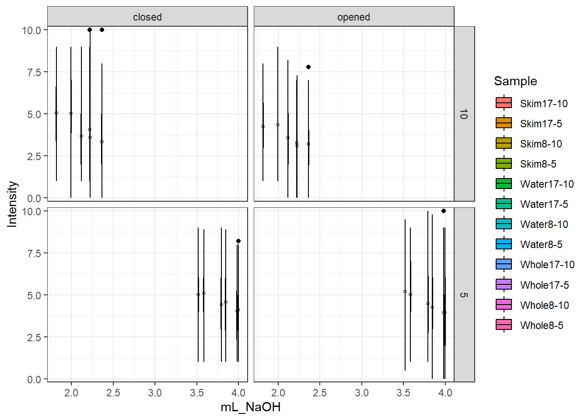

# Titratable Acidity, pH, and Sourness {#TA}


## Titratable Acidity


``` r
aov10.8 <- aov(mL_NaOH ~ Sample + Rep, data = TA10.8)
summary(aov10.8)
```

```
            Df  Sum Sq Mean Sq F value Pr(>F)  
Sample       2 0.07614 0.03807   5.026  0.081 .
Rep          2 0.01395 0.00697   0.921  0.469  
Residuals    4 0.03030 0.00757                 
---
Signif. codes:  0 '***' 0.001 '**' 0.01 '*' 0.05 '.' 0.1 ' ' 1
```

``` r
print(LSD.test(aov10.8, trt = "Sample")$groups)
```

```
           mL_NaOH groups
Whole8-10 2.219433      a
Skim8-10  2.118067     ab
Water8-10 1.994500      b
```

``` r
# marginal change in TA

aov10.17 <- aov(mL_NaOH ~ Sample + Rep, data = TA10.17)
summary(aov10.17)
```

```
            Df Sum Sq Mean Sq F value  Pr(>F)   
Sample       2 0.4796 0.23981  28.044 0.00443 **
Rep          2 0.0194 0.00970   1.134 0.40729   
Residuals    4 0.0342 0.00855                   
---
Signif. codes:  0 '***' 0.001 '**' 0.01 '*' 0.05 '.' 0.1 ' ' 1
```

``` r
print(LSD.test(aov10.17, trt = "Sample")$groups)
```

```
            mL_NaOH groups
Skim17-10  2.363733      a
Whole17-10 2.224067      a
Water17-10 1.819367      b
```

``` r
# water significantly less acidic than milk additions

aov5.8 <- aov(mL_NaOH ~ Sample + Rep, data = TA5.8)
summary(aov5.8)
```

```
            Df  Sum Sq Mean Sq F value Pr(>F)
Sample       2 0.11571 0.05786   3.869  0.116
Rep          2 0.01323 0.00662   0.442  0.671
Residuals    4 0.05981 0.01495               
```

``` r
print(LSD.test(aov5.8, trt = "Sample")$groups)
```

```
          mL_NaOH groups
Whole8-5 3.845333      a
Skim8-5  3.793267      a
Water8-5 3.583033      a
```

``` r
# no difference in TA

aov5.17 <- aov(mL_NaOH ~ Sample + Rep, data = TA5.17)
summary(aov5.17)
```

```
            Df Sum Sq Mean Sq F value  Pr(>F)   
Sample       2 0.4423 0.22113  36.931 0.00264 **
Rep          2 0.0019 0.00097   0.163 0.85519   
Residuals    4 0.0240 0.00599                   
---
Signif. codes:  0 '***' 0.001 '**' 0.01 '*' 0.05 '.' 0.1 ' ' 1
```

``` r
print(LSD.test(aov5.17, trt = "Sample")$groups)
```

```
           mL_NaOH groups
Whole17-5 3.996000      a
Skim17-5  3.980867      a
Water17-5 3.518367      b
```

``` r
# water significantly less acidic
```

- AOV model includes Sample and Rep main effects on mL NaOH readings  
  + no rep effects seen in anovas (p > 0.05)
  + at 1:10 and 8% addition, water was significantly different from whole milk addition
  + at 17% addition (both 1:10 and 1:5), water was significantly different from either milk addition


``` r
coffeelevels <- c("Water", "Skim", "Whole",
            "Black5", "Black10",
            "Skim17-5", "Whole17-5", "Water17-5",
            "Skim8-5", "Whole8-5","Water8-5", 
            "Skim17-10", "Whole17-10", "Water17-10",
            "Skim8-10", "Whole8-10", "Water8-10") 

TASummary <- summarySE(data = TAReadings, measurevar = "mL_NaOH", groupvars = "Sample") %>% select(Sample, mL_NaOH, sd) %>% arrange(factor(Sample, levels = coffeelevels)) %>% slice(-(1:5))

TASummary$groups <- c("A", "A", "B", "A", "A", "A",
                      "A", "A", "B", "AB", "A", "B")

coffeeorder <- c("Skim8-10", "Whole8-10", "Water8-10",
                  "Skim17-10", "Whole17-10", "Water17-10",
                  "Skim8-5", "Whole8-5","Water8-5",
                  "Skim17-5", "Whole17-5", "Water17-5")

TASummary$Sample <- factor(TASummary$Sample, levels = coffeeorder)
```


<div class="figure">

<p class="caption">(\#fig:TAGroupsViz)Titratable acidity (mean +/- standard deviation) of cold brew coffee samples with either skim milk, whole milk, or water added. For example, Skim8-10 has 8% skim milk added to a cold brew coffee at a 1:10 brew strength. Samples within a section that do not share a letter are significantly different as determined by a 2-way ANOVA (sample and rep) and LSD post-hoc test.</p>
</div>

## TA Percent Acid

$$
\%\ acid\ (w/v) = \frac{N \cdot V_1 \cdot Eq wt}{V_2 \cdot 1000} \cdot 100
$$

where  

- N = normality of titrant
- $V_1$ = volume of titrant
- Eqwt = equivalent weight of relevant acid
+ Eqwt CGA = 354.31
- $V_2$ = volume of solution


- AOV model includes Sample and Rep main effects on percent CGA calculations  
  + no rep effects seen in anovas (p > 0.05)
  + at 1:10 and 8% addition, water was significantly different from whole milk addition
  + at 17% addition (both 1:10 and 1:5), water was significantly different from either milk addition


```
##        Sample  mL_NaOH          sd groups
## 1    Skim17-5 3.980867 0.046687721      A
## 2   Whole17-5 3.996000 0.073982971      A
## 3   Water17-5 3.518367 0.072777904      B
## 4     Skim8-5 3.793267 0.120494039      A
## 5    Whole8-5 3.845333 0.034670785      A
## 6    Water8-5 3.583033 0.144231666      A
## 7   Skim17-10 2.363733 0.156855804      A
## 8  Whole17-10 2.224067 0.005644762      A
## 9  Water17-10 1.819367 0.046502294      B
## 10   Skim8-10 2.118067 0.022627491     AB
## 11  Whole8-10 2.219433 0.017810484      A
## 12  Water8-10 1.994500 0.145922274      B
```


<div class="figure">

<p class="caption">(\#fig:CGAGroupsViz)Percent chlorogenic acid (CGA) (mean +/- standard deviation) of cold brew coffee samples with either skim milk, whole milk, or water added. For example, Skim8-10 has 8% skim milk added to a cold brew coffee at a 1:10 brew strength. Samples within a section that do not share a letter are significantly different as determined by a 2-way ANOVA (sample and rep) and LSD post-hoc test.</p>
</div>

## Correlation with Sour Ratings
### TA Readings + Sourness


``` r
unique(brew10closedsour_ratings_long$Sample)
```

```
##  [1] "sourness_13" "sourness_15" "sourness_14" "sourness_17" "sourness_16"
##  [6] "sourness_18" "sourness_19" "sourness_21" "sourness_20" "sourness_23"
## [11] "sourness_22" "sourness_24"
```

``` r
brew10closedsour_ratings_long <- brew10closedsour_ratings_long %>% 
  mutate(Sample = recode(Sample, "sourness_13" = "Skim17-10")) %>% 
  mutate(Sample = recode(Sample, "sourness_14" = "Skim17-10")) %>% 
  mutate(Sample = recode(Sample, "sourness_15" = "Whole17-10")) %>% 
  mutate(Sample = recode(Sample, "sourness_16" = "Whole17-10")) %>% 
  mutate(Sample = recode(Sample, "sourness_17" = "Water17-10")) %>% 
  mutate(Sample = recode(Sample, "sourness_18" = "Water17-10")) %>% 
  mutate(Sample = recode(Sample, "sourness_19" = "Skim8-10")) %>% 
  mutate(Sample = recode(Sample, "sourness_20" = "Skim8-10")) %>% 
  mutate(Sample = recode(Sample, "sourness_21" = "Whole8-10")) %>% 
  mutate(Sample = recode(Sample, "sourness_22" = "Whole8-10")) %>% 
  mutate(Sample = recode(Sample, "sourness_23" = "Water8-10")) %>% 
  mutate(Sample = recode(Sample, "sourness_24" = "Water8-10")) 

unique(df10openedSour_ratings_long$Sample)
```

```
##  [1] "sourness_13" "sourness_15" "sourness_14" "sourness_17" "sourness_16"
##  [6] "sourness_18" "sourness_19" "sourness_21" "sourness_20" "sourness_23"
## [11] "sourness_22" "sourness_24"
```

``` r
df10openedSour_ratings_long <- df10openedSour_ratings_long %>% 
  mutate(Sample = recode(Sample, "sourness_13" = "Skim17-10")) %>% 
  mutate(Sample = recode(Sample, "sourness_14" = "Skim17-10")) %>% 
  mutate(Sample = recode(Sample, "sourness_15" = "Whole17-10")) %>% 
  mutate(Sample = recode(Sample, "sourness_16" = "Whole17-10")) %>% 
  mutate(Sample = recode(Sample, "sourness_17" = "Water17-10")) %>% 
  mutate(Sample = recode(Sample, "sourness_18" = "Water17-10")) %>% 
  mutate(Sample = recode(Sample, "sourness_19" = "Skim8-10")) %>% 
  mutate(Sample = recode(Sample, "sourness_20" = "Skim8-10")) %>% 
  mutate(Sample = recode(Sample, "sourness_21" = "Whole8-10")) %>% 
  mutate(Sample = recode(Sample, "sourness_22" = "Whole8-10")) %>% 
  mutate(Sample = recode(Sample, "sourness_23" = "Water8-10")) %>% 
  mutate(Sample = recode(Sample, "sourness_24" = "Water8-10")) 

unique(brew5closedsour_ratings_long$Sample)
```

```
##  [1] "sourness_1"  "sourness_3"  "sourness_2"  "sourness_5"  "sourness_4" 
##  [6] "sourness_6"  "sourness_7"  "sourness_9"  "sourness_8"  "sourness_11"
## [11] "sourness_10" "sourness_12"
```

``` r
brew5closedsour_ratings_long <- brew5closedsour_ratings_long %>% 
  mutate(Sample = recode(Sample, "sourness_1" = "Skim17-5")) %>% 
  mutate(Sample = recode(Sample, "sourness_2" = "Skim17-5")) %>% 
  mutate(Sample = recode(Sample, "sourness_3" = "Whole17-5")) %>% 
  mutate(Sample = recode(Sample, "sourness_4" = "Whole17-5")) %>% 
  mutate(Sample = recode(Sample, "sourness_5" = "Water17-5")) %>% 
  mutate(Sample = recode(Sample, "sourness_6" = "Water17-5")) %>% 
  mutate(Sample = recode(Sample, "sourness_7" = "Skim8-5")) %>% 
  mutate(Sample = recode(Sample, "sourness_8" = "Skim8-5")) %>% 
  mutate(Sample = recode(Sample, "sourness_9" = "Whole8-5")) %>% 
  mutate(Sample = recode(Sample, "sourness_10" = "Whole8-5")) %>% 
  mutate(Sample = recode(Sample, "sourness_11" = "Water8-5")) %>% 
  mutate(Sample = recode(Sample, "sourness_12" = "Water8-5")) 

unique(df5openedSour_ratings_long$Sample)
```

```
##  [1] "sourness_1"  "sourness_3"  "sourness_2"  "sourness_5"  "sourness_4" 
##  [6] "sourness_6"  "sourness_7"  "sourness_9"  "sourness_8"  "sourness_11"
## [11] "sourness_10" "sourness_12"
```

``` r
df5openedSour_ratings_long <- df5openedSour_ratings_long %>% 
  mutate(Sample = recode(Sample, "sourness_1" = "Skim17-5")) %>% 
  mutate(Sample = recode(Sample, "sourness_2" = "Skim17-5")) %>% 
  mutate(Sample = recode(Sample, "sourness_3" = "Whole17-5")) %>% 
  mutate(Sample = recode(Sample, "sourness_4" = "Whole17-5")) %>% 
  mutate(Sample = recode(Sample, "sourness_5" = "Water17-5")) %>% 
  mutate(Sample = recode(Sample, "sourness_6" = "Water17-5")) %>% 
  mutate(Sample = recode(Sample, "sourness_7" = "Skim8-5")) %>% 
  mutate(Sample = recode(Sample, "sourness_8" = "Skim8-5")) %>% 
  mutate(Sample = recode(Sample, "sourness_9" = "Whole8-5")) %>% 
  mutate(Sample = recode(Sample, "sourness_10" = "Whole8-5")) %>% 
  mutate(Sample = recode(Sample, "sourness_11" = "Water8-5")) %>% 
  mutate(Sample = recode(Sample, "sourness_12" = "Water8-5")) 

colnames(df5openedSour_ratings_long)
```

```
## [1] "participant" "Sample"      "Intensity"   "coffee"      "cond"
```

``` r
brew10sour <- full_join(brew10closedsour_ratings_long, df10openedSour_ratings_long, by = c("participant", "Sample", "Intensity", "coffee", "cond"))
brew5sour <- full_join(brew5closedsour_ratings_long, df5openedSour_ratings_long, by = c("participant", "Sample", "Intensity", "coffee", "cond"))
sourDF <- full_join(brew10sour, brew5sour)
```

```
## Joining with `by = join_by(participant, Sample, Intensity, coffee, cond)`
```

``` r
view(sourDF)

sourTAjoined <- full_join(sourDF, TASummary)
```

```
## Joining with `by = join_by(Sample)`
```

``` r
view(sourTAjoined)
```


``` r
sourTAjoined %>% drop_na() %>% 
  ggplot(aes(x = mL_NaOH, y = Intensity)) +
  facet_grid(coffee~cond) +
  geom_boxplot(aes(fill = Sample), color = "black") +
  stat_summary(fun = mean, geom = "point", shape = 21, size = 1) +
  theme_bw() +
  scale_y_continuous(expand = c(0,.2))
```



